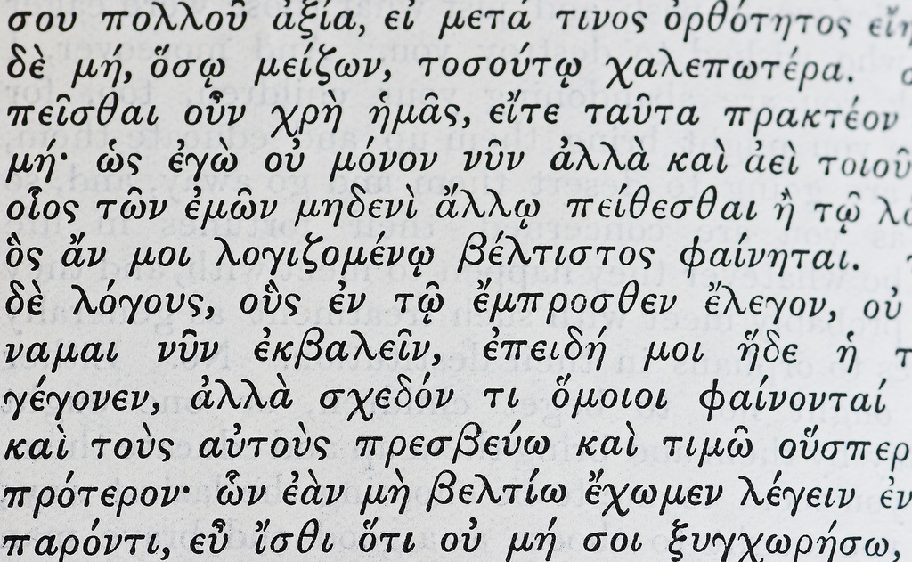

======================
Why's my program slow? 
======================

Algorithmic Complexity and You

.. note::
    
    http://www.vrplumber.com/programming/runsnakerun/
    http://bigocheatsheet.com/
    http://accidentallyquadratic.tumblr.com/

    advanced algorithms resources: https://gist.github.com/debasishg/8172796

Hello
=====

* I was in Computer Science at OSU for 5 years
* Many hats have included software developer (Intel and OSL)

.. note:: 

    Before upper-division CS classes, I thought there was some kind of secret
    sauce and complexity was super scary

    Afterwards it's clear how simple things are, so much that the core
    concepts can fit into an hour at a conference

    The difficulty is in the details, and this stuff is still indescribably
    tough to implement at the compiler level, but understanding the high-level
    view can help you ask smart questions and better understand real-world
    code

Why this talk?
--------------

.. note:: 

    before I took algorithms classes at OSU, I thought complexity was secret
    magic that only "real computer scientists" could understand... afterwards
    it looked like common sense

    not everybody in the real world gets the academic side; not everyone in
    academia gets the real-world side; i'm here to teach you about both

    I hope you'll get 3 things today:
        * Convinced that you can be a Real Computer Scientist too
        * Tools for comparing algorithms
        * A better set of basic questions to ask when analyzing program
          performance

Recap
-----

TODO: picture of "real computer scientists", wizards?

.. note::

    recap what they'll get

What's complexity?
==================

.. figure:: pics/compiling.png
    :align: center
    :alt: Image from XKCD https://imgs.xkcd.com/comics/compiling.png

.. note:: 

    Why do they have time for a sword fight while the compiler runs? 

    There are two factors: The compiler has to do *many operations* (this
    scales with how big a program you compile) and each operation takes *some
    time* (this is something which can be optimized in the compiler)

How Long it Takes
-----------------

(or how much space it takes)

* "5 minutes"

In terms of input size
----------------------

Example: if Project Euler is having you find prime factors of a number, and
you test your code on small numbers and it's fast, and then you put in the big
number and it takes a really really long time

**n** is the size of the input.

http://www.catb.org/jargon/html/N/N.html

Quantified in fancy notation
----------------------------

If the loop runs n times, and takes C (some constant) seconds per loop

Not like C the language; C like a constant amount of time

O(n)

Sound smarter? And write less? Win-Win! 

Graph of why it's "usually ok to omit the constant" (more on that later)

How do you find how many times it runs?
---------------------------------------

Simplify into psuedo-code till you just have loops

Examine them

(Basic test of fluency and understanding of your language of choice, like
fizzbuzz)

There are also tools for this, which we'll get to later

Example with an O(n) algo
-------------------------

* Starter code
* Simplify into psuedocode
* Count the loops

Example with O(log(n))
----------------------

* Starter code
* Simplify into psuedocode
* Count the loops

Example with O(n^2)
-------------------

* Starter code
* Simplify into psuedocode
* Count the loops

Which is fastest? Slowest?
--------------------------

Graphs! And more graphs!

Now you Try It
--------------

Example of an nlog(n) algo, walk through the steps

* Starter code
* Simplify into psuedocode
* Count the loops

Some Details
------------

Big-Oh is expected case; we also have notation for best case and worst case

simple examples: naive vs optimized code, short-circuiting

introduce formalism of big-oh, big-omega, big-theta notation 
<joke about frats>

.. note:: 

    `CMU intro CS notes <http://www.cs.cmu.edu/~adamchik/15-121/lectures/Algorithmic%20Complexity/complexity.html>`_
    `topcoder tutorial <http://community.topcoder.com/tc?module=Static&d1=tutorials&d2=complexity1>`_
    `study guide <http://www.studytonight.com/data-structures/time-complexity-of-algorithms>`_

Example: Searching a sorted array
---------------------------------

.. #TODO: This slide goes away?

Brute Force

.. code-block:: python

    def brute_force_search(l, value):
        for i in range(len(l)):
            if l[i] == value:
                return i
        return -1 
    

Binary Search
-------------

.. code-block:: python

    def binary_search(l, value):
        low = 0
        high = len(l)-1
        while low <= high: 
            mid = (low+high)//2
            if l[mid] > value: high = mid-1
            elif l[mid] < value: low = mid+1
            else: return mid
        return -1

(from `rosettacode <http://rosettacode.org/wiki/Binary_search#Python>`_)

Space Complexity
----------------

how much memory does it take? 

In-place sorting vs sorting by copying the array

* What if your array is > 1/2 your disk?
* Constant is the size of an item being sorted

Graphs of space complexity and show how they look quite a bit like time
complexity

.. note::
    
    TODO: sorting algos, in-place vs otherwise. example of very large arrays
    or very small memory, where this would actually matter

Reversing an Array
------------------

copy elements::

    function reverse(a[0..n - 1])
        allocate b[0..n - 1]
        for i from 0 to n - 1
            b[n − 1 − i] := a[i]
            return b

vs in-place::

    function reverse_in_place(a[0..n-1])
        for i from 0 to floor((n-2)/2)
            tmp := a[i]
            a[i] := a[n − 1 − i]
            a[n − 1 − i] := tmp 

What about recursive functions?
-------------------------------

* time complexity: expected number of calls * time in call
* space complexity: risk running out of stack

.. note::

    TODO: example where you halve the complexity by reusing results of a call;
    fibonnacci?

best vs worst case
------------------

* best
* worst
* average
* amortized

.. note:: 
    
    TODO: explain big theta and big omega; look them up in the book
    `explanation of amortized <http://stackoverflow.com/questions/15079327/amortized-complexity-in-laymans-terms>`_

Feeling like a Real Computer Scientist yet?
===========================================

.. #TODO picture of grace hoppper era switchboard operators

Comparing Algorithms
--------------------

Graph of "slow" with small C vs "fast" with huge C

Which one is better?

<wait for answers>

Yeah so it turns out real life is complicated and difficult. 

That Constant
-------------

IRL, constant times differ by several orders of magnitude. 

* Processor memory vs L1 cache
* Cache vs RAM
* RAM vs hitting the disk
* Local disk vs across the datacenter
* Across the datacenter vs over wifi or a cell network
* Wifi or cell vs another continent

.. note:: 

    Grace Hopper and the Nanoseconds
    TODO: bring nanoseconds?

metaphor: going to the fridge vs going to the store vs going to the moon

Throwing out that constant...
-----------------------------

.. #TODO maybe ditch this slide?

.. note:: 

    TODO graphs again of big constant and log time vs tiny constant and linear
    time

In The Real World
=================

.. figure:: pics/xkcd1205.png
    :align: center

.. note:: 

    Approximately last 15mins?

    same things apply to saving time in your algorithm

Good Code
---------

* Correct
* **Efficient**
* Simple
* Readable
* Maintainable

.. note:: from cracking the coding interview, p. 56

Is my program slow?
-------------------

Expected input size?
How's it do in tests?
(you are testing it, right?)
How much of test suite time is setup/teardown?
what will real-world conditions look like?
    * and under heavy load? (CACHING CACHING CACHING)

.. note:: 

    TODO: tools/frameworks for mocking heavy load on a program
    Worst case vs expected case

    Slow to perform vs slow to write

Is my program *too* slow?
-------------------------

Is speed the worst problem that it has right now?
What's the minimum that'll make your users happy?
What's the maximum past which your users won't notice improvements?
How long will it take the team to make the next big speedup...
* And would fixing any of the intermediat issues decrease that time
  substantially? (ie refactor to remove old cruft)

Why is my program slow?
-----------------------

<picture representing bad news>

It's probably not how you structured your algorithm. Or you fix the obvious
algorithmic stupidity and it's still bad. 

Remember the orders of magnitude thing?

.. note::

    * Profiling tools are your friends
    * platform-agnostic -- how to get a graph of performance for various inputs
    * language-specific profiling tools
    * maybe it's slow in the real world because reality is different from your
      test cases

Why's my program slow? 
----------------------

<screenshot of size of a gh repo for a decent sized project>

* it's hard to see where an algorithm spends its time
* working from a wrong guess about where the bottleneck is will waste yours

.. note::

    "a slow program" could mean two things: code that's not performant, or
    code that takes forever to acutally get written. sometimes one is worse
    than the other.

Algorithmic complexity in real code
-----------------------------------

* "the pros" can look at a section of code and tell you its best, worst, and
  average-case performance -- kind of like how we practiced earlier

* they do this by recognizing patterns from having read a lot of other code

* if the patterns aren't clear to you, write out what your code is doing --
  psuedo-code -- simplify it till all you have are bits that'll take constant
  time, and loops

Expected Use Case
-----------------

graphs of how exponential time with a really tiny constant compares to linear
time with a really huge constant, especially for small n

.. note:: 

    TODO: GRAPHS of high constant vs low constant, fast vs slow -- same graphs
    as before -- AGAIN, this is why context is critical

Analysis Tools
--------------

.. note::

    TODO: sort them
    * specific vs general
    * automated vs manual
    * language-specific vs platform-agnostic

Languages

Python: Run Snake Run <pictures>

C: GDB/`gprof <https://sourceware.org/binutils/docs/gprof/>`_

Instrumentation
---------------

http://en.wikipedia.org/wiki/Instrumentation_%28computer_programming%29

http://commons.wikimedia.org/wiki/File:Pork_thermometer.jpg

Python
------

https://docs.python.org/2/library/profile.html

Testing
-------

.. note:: TODO

    examples of frameworks and stuff being applied

Continuous Integration Is Awesome (duh)

Example of how easy it is to introduce a regression

Troubleshooting
---------------

.. TODO why is this section even here

Recap
-----

Learned about complexity
    * Simplify the code
    * Count how often it'll run for a given size of input
    * Toss out the constants
Complexity isn't the entire picture
    * That constant actually matters
    * Premature optimization is bad for everyone
    * Code that never gets finished was the slowest of all
Tools are great, in their place
    * Instrumentation hooks into your code
    * Profilers watch where it spends its time
    * Test suite can check how long it takes on every change to find
      regressions

