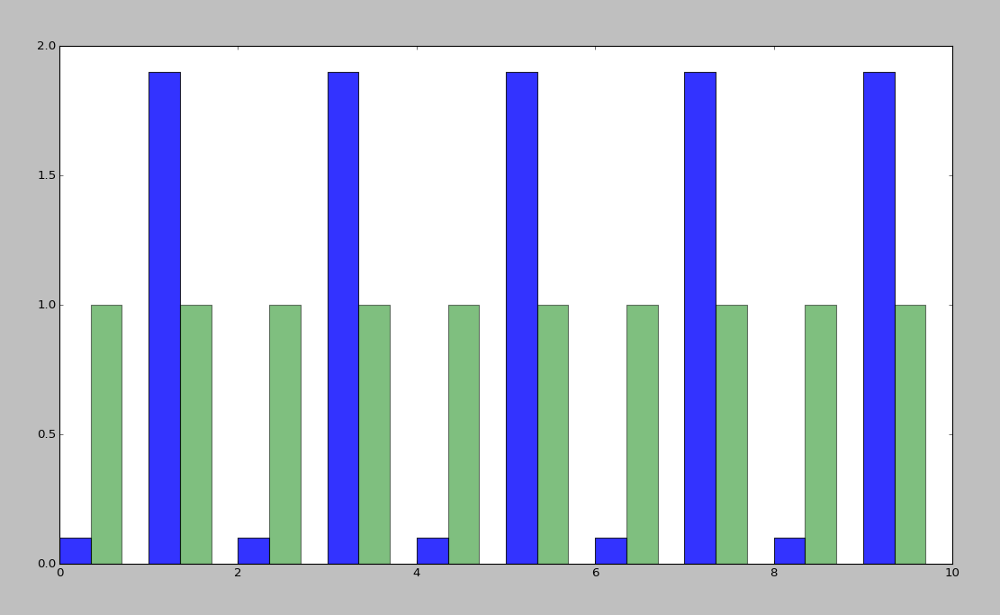
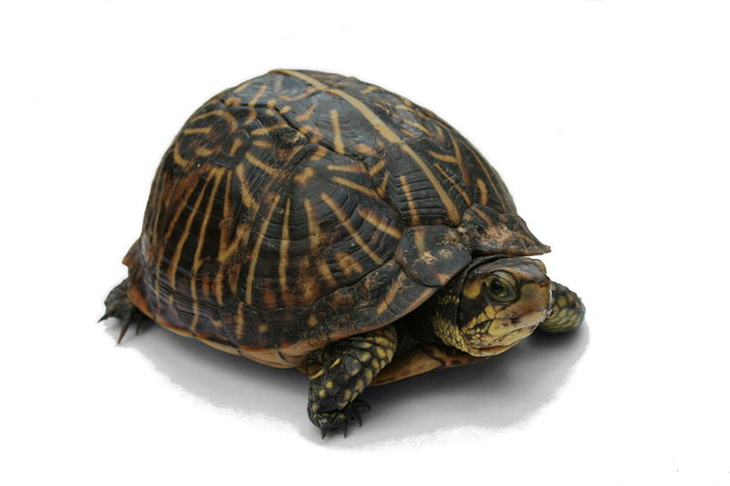

======================
Why's my program slow? 
======================

Algorithmic Complexity and You

.. note::
    
    http://www.vrplumber.com/programming/runsnakerun/
    http://bigocheatsheet.com/
    http://accidentallyquadratic.tumblr.com/

    advanced algorithms resources: https://gist.github.com/debasishg/8172796

Hello
=====

* Emily Dunham
* edunham on Freenode
* edunham@edunham.net
* No Twitter

These slides are online at:

http://talks.edunham.net/linuxfestnorthwest2015/complexity/

.. note:: 

    * I was in Computer Science at OSU for 5 years
    * Many hats have included software developer (Intel and OSL)

    Before upper-division CS classes, I thought there was some kind of secret
    sauce and complexity was super scary

    Afterwards it's clear how simple things are, so much that the core
    concepts can fit into an hour at a conference

    The difficulty is in the details, and this stuff is still indescribably
    tough to implement at the compiler level, but understanding the high-level
    view can help you ask smart questions and better understand real-world
    code

Why this talk?
--------------

    https://www.flickr.com/photos/chefranden/3183416126/

.. note:: 

    before I took algorithms classes at OSU, I thought complexity was secret
    magic that only "real computer scientists" could understand... afterwards
    it looked like common sense

    not everybody in the real world gets the academic side; not everyone in
    academia gets the real-world side; i'm here to teach you about both

    I hope you'll get 3 things today:
        * Convinced that you can be a Real Computer Scientist too
        * Tools for comparing algorithms
        * A better set of basic questions to ask when analyzing program
          performance

Agenda
------

In Theory
* Motivations for complexity analysis
* Meaning of the notation
* Techniques for analyzing complexity
* Examples

In Practice
* What problem are you solving?
* Alternate Tools

In Theory
=========

Coursera:
    * `Stanford <https://www.coursera.org/course/algo>`_
    * `Princeton <https://www.coursera.org/course/aofa>`_

Syllabi:
    * http://openclassroom.stanford.edu/MainFolder/CoursePage.php?course=IntroToAlgorithms

    http://commons.wikimedia.org/wiki/File:Swiss_Jungfrau_mountains.jpg

.. note:: 

    scope of this talk will be small though available knowledge is vast

    jumping into the graduate level stuff here would be like a talk on getting
    started with recreational hiking focusing on what to take for a month in
    the Alps, rather than focusing on what to pack for a picnic in a nearby park

What's complexity?
==================

.. figure:: pics/compiling.png
    :align: center
    
    https://imgs.xkcd.com/comics/compiling.png

.. note:: 

    Why do they have time for a sword fight while the compiler runs? 

    There are two factors: The compiler has to do *many operations* (this
    scales with how big a program you compile) and each operation takes *some
    time* (this is something which can be optimized in the compiler)

How Long it Takes
-----------------

    http://commons.wikimedia.org/wiki/File:Analog_clock_animation.gif

.. note:: 

    How long does your code take to run?

    "About 2 minutes to compile"?

    "About half an hour to run all the tests"?

    NEXT: in terms of input size

In terms of input size
----------------------

.. figure:: pics/euler.png
    :align: right

    https://projecteuler.net/

* Project Euler
* Solution fast on small input
* Very slow on large input

**n** is the size of the input.

    N: /N/, quant.

    1. A large and indeterminate number of objects: “There were N bugs in that
           crock!” Also used in its original sense of a variable name: “This
           crock has N bugs, as N goes to infinity.”

http://www.catb.org/jargon/html/N/N.html

Quantified in fancy notation
----------------------------

|

**O(n)**

|

(time in loop) * (times the loop runs) + (time outside of loop)

.. note::

    Not like C the language; C like a constant amount of time

    O(n)

    Sound smarter? And write less? Win-Win! 

Graph of why it's "usually ok to omit the constant" (more on that later)

(Math Words)
------------

    http://upload.wikimedia.org/wikipedia/commons/thumb/8/89/Pure-mathematics-formul%C3%A6-blackboard.jpg/220px-Pure-mathematics-formul%C3%A6-blackboard.jpg

.. note::

    http://www.cs.cmu.edu/~adamchik/15-121/lectures/Algorithmic%20Complexity/complexity.html

    monotonic = always-increasing or always-decreasing

For any monotonic functions f(n) and g(n) from the positive integers to the
positive integers, we say that f(n) = O(g(n)) when there exist constants c > 0
and n[0] > 0 such that::

    f(n) ≤ c * g(n), for all n ≥ n[0]

P vs NP
-------

    http://www.public-domain-image.com/objects-public-domain-images-pictures/electronics-devices-public-domain-images-pictures/computer-components-pictures/computer-inside.jpg.html

.. note:: 

    How many of you really understood the P vs NP thing?

    "NP problems are really 'hard', P problems are 'solvable'"

    P is problems that can be SOLVED in polynomial time
    
    NP is problems that can be VERIFIED in polynomial time

    x^2 is polynomial; 2^x is exponential

    Traveling salesman by brute force (shortest route between all cities) is
    O(n!)

    http://en.wikipedia.org/wiki/Travelling_salesman_problem

How do you find how many times it runs?
---------------------------------------

|

    https://www.flickr.com/photos/dalager/14110369/

.. note::
    First find n

    Simplify into psuedo-code till you just have loops

    Examine them

    (Basic test of fluency and understanding of your language of choice, like
    fizzbuzz)

    There are also tools for this, which we'll get to later

Example: Linear Search
----------------------

Disclaimer: If you use this implementation in an interview, you will not get
the job.

.. code-block:: python

    needle = '4'
    haystack = [2, 8, 23, 5, 4, 7, 42]

    idx = 0
    while haystack[idx] < len(haystack):    
        if haystack[idx] == needle:
            print "Found it at index " + str(idx)
        idx += 1

.. note::
    Let's say we're looking for "needle" in "haystack" 

Find n
------

.. code-block:: python

    needle = '4'
    haystack = [2, 8, 23, 5, 4, 7, 42]

    idx = 0
    while haystack[idx] < len(haystack):    
        if haystack[idx] == needle:
            print "Found it at index " + str(idx)
        idx += 1

Count the Loops
---------------

n is len(haystack)

.. code-block:: python

    needle = '4'
    haystack = [2, 8, 23, 5, 4, 7, 42]

    idx = 0
    while haystack[idx] < len(haystack):    
        if haystack[idx] == needle:
            print "Found it at index " + str(idx)
        idx += 1

There's the complexity!
-----------------------

* loop once over n items

* Contents is constant time

* Complexity is O(n)

Example: Finding Repeated Words
-------------------------------

Same disclaimer as before. 

.. code-block:: python

    words = ['linux', 'washington', 'linux', 'festival']
    idx = 0
    while idx < len(words):
        check = 0
        while check < len(words):
            if idx != check and words[check] == words[idx]:
                print "found a repeated word!"

First find n
------------

|

.. code-block:: python

    words = ['linux', 'washington', 'linux', 'festival']
    idx = 0
    while idx < len(words):
        check = 0
        while check < len(words):
            if idx != check and words[check] == words[idx]:
                print "found a repeated word!"

Then count loops
----------------

n is len(words)

.. code-block:: python

    words = ['linux', 'washington', 'linux', 'festival']
    idx = 0
    while idx < len(words):
        check = 0
        while check < len(words):
            if idx != check and words[check] == words[idx]:
                print "found a repeated word!"

There's the complexity!
-----------------------

* Outer loop goes **n** times
* inner loop goes **n** times

* Inner loop runs every time the outer does

* Complexity is n*n, or n^2

Tangent: If that was an interview...
------------------------------------

.. code-block:: python

    words = ['linux', 'washington', 'linux', 'festival']
    idx = 0
    while idx < len(words):
        check = 0
        while check < len(words):
            if idx != check and words[check] == words[idx]:
                print "found a repeated word!"

.. note:: faster to sort the list (sorts can go very fast) then traverse once,
    comparing each item to the previous

What's the Difference?
======================

.. note:: 

    This graphs a bunch of complexities: 

    Exponential is red (constant raised to the n)

    Quadratic is black

    Linear is cyan

    nlogn is green

    logarithmic is blue

Without exponential
-------------------

.. figure:: pics/graph_noexponeitial.png
    :align: center

.. note:: 

    Quadratic is black

    Linear is cyan

    nlogn is green

    logarithmic is blue

Now you Try It
--------------

.. code-block:: python

    def binary_search(l, value):
        low = 0
        high = len(l)-1
        while low <= high: 
            mid = (low+high)//2
            if l[mid] > value: high = mid-1
            elif l[mid] < value: low = mid+1
            else: return mid
        return -1

First find n
------------

.. code-block:: python

    def binary_search(l, value):
        low = 0
        high = len(l)-1
        while low <= high: 
            mid = (low+high)//2
            if l[mid] > value: high = mid-1
            elif l[mid] < value: low = mid+1
            else: return mid
        return -1

Count the loops
---------------

.. code-block:: python

    def binary_search(l, value):
        low = 0
        high = len(l)-1
        while low <= high: 
            mid = (low+high)//2
            if l[mid] > value: high = mid-1
            elif l[mid] < value: low = mid+1
            else: return mid
        return -1

There's the complexity
----------------------

|

Binary search is log(n)

|

"In mathematics, the logarithm of a number is the exponent to which another
fixed value, the base, must be raised to produce that number."

Some Details
------------

big-oh is UPPER BOUND

big-omega is LOWER BOUND -- the program can never run faster than this

Big theta (not all programs will have this) is when upper and lower bounds
match

.. note:: 

    `CMU intro CS notes <http://www.cs.cmu.edu/~adamchik/15-121/lectures/Algorithmic%20Complexity/complexity.html>`_
    `topcoder tutorial <http://community.topcoder.com/tc?module=Static&d1=tutorials&d2=complexity1>`_
    `study guide <http://www.studytonight.com/data-structures/time-complexity-of-algorithms>`_

Amortized Complexity
--------------------

.. note::

    http://stackoverflow.com/questions/15079327/amortized-complexity-in-laymans-terms

If a slow operation is done infrequently, we can spread its cost over all the
times it didn't happen...

How about recursive?
--------------------

.. code-block:: python

    def binary_search(l, value, low = 0, high = -1):
        if not l: 
            return -1
        if(high == -1): high = len(l)-1
        if low == high:
            if l[low] == value: return low
            else: 
                return -1
        mid = (low+high)//2
        if l[mid] > value: 
            return binary_search(l, value, low, mid-1)
        elif l[mid] < value: 
            return binary_search(l, value, mid+1, high)
        else: return mid

Space Complexity
----------------

how much memory does it take? 

In-place sorting vs sorting by copying the array

* What if your array is > 1/2 your disk?
* Constant is the size of an item being sorted

Graphs of space complexity and show how they look quite a bit like time
complexity

.. note::
    
    TODO: sorting algos, in-place vs otherwise. example of very large arrays
    or very small memory, where this would actually matter

Reversing an Array
------------------

copy elements::

    function reverse(a[0..n - 1])
        allocate b[0..n - 1]
        for i from 0 to n - 1
            b[n − 1 − i] := a[i]
            return b

vs in-place::

    function reverse_in_place(a[0..n-1])
        for i from 0 to floor((n-2)/2)
            tmp := a[i]
            a[i] := a[n − 1 − i]
            a[n − 1 − i] := tmp 

Feeling like a Real Computer Scientist yet?
===========================================

.. figure:: pics/lovelace.jpg
    :align: center

    http://en.wikipedia.org/wiki/File:Ada_lovelace.jpg

That Constant
-------------

Constant times differ by several orders of magnitude. 

* Processor memory vs L1 cache
* Cache vs RAM
* RAM vs hitting the disk
* Local disk vs across the datacenter
* Across the datacenter vs over wifi or a cell network
* Wifi or cell vs another continent

.. note:: 

    Grace Hopper and the Nanoseconds

    metaphor: going to the fridge vs going to the store vs going to the moon

In The Real World
=================

.. figure:: pics/xkcd1205.png
    :align: center

.. note:: 

    Approximately last 15mins?

    same things apply to saving time in your algorithm

Good Code
---------

* Correct
* **Efficient**
* Simple
* Readable
* Maintainable

.. note:: from cracking the coding interview, p. 56

Is my program slow?
-------------------

Expected input size?
How's it do in tests?
(you are testing it, right?)
How much of test suite time is setup/teardown?
what will real-world conditions look like?
    * and under heavy load? (CACHING CACHING CACHING)

.. note:: 

    TODO: tools/frameworks for mocking heavy load on a program
    Worst case vs expected case

    Slow to perform vs slow to write

Is my program *too* slow?
-------------------------

    http://en.wikipedia.org/wiki/File:Ada_lovelace.jpg

.. note:: 

    Is speed the worst problem that it has right now?
    
    What's the minimum that'll make your users happy?
    
    What's the maximum past which your users won't notice improvements?
    
    How long will it take the team to make the next big speedup...
    
    * And would fixing any of the intermediat issues decrease that time
      substantially? (ie refactor to remove old cruft)

Why is my program slow?
-----------------------

It's probably not how you structured your algorithm. Or you fix the obvious
algorithmic stupidity and it's still bad. 

Remember the orders of magnitude thing?

.. note::

    * Profiling tools are your friends
    * platform-agnostic -- how to get a graph of performance for various inputs
    * language-specific profiling tools
    * maybe it's slow in the real world because reality is different from your
      test cases

* Hard to see where an algorithm spends its time
* Working from a wrong guess about where the bottleneck is will waste yours

.. note::

    "a slow program" could mean two things: code that's not performant, or
    code that takes forever to acutally get written. sometimes one is worse
    than the other.

Algorithmic complexity in real code
-----------------------------------

* "the pros" can look at a section of code and tell you its best, worst, and
  average-case performance -- kind of like how we practiced earlier

* Recognizing patterns from having read a lot of other code

.. note::

    * If the patterns aren't clear to you, write out what your code is doing
    -- psuedo-code -- simplify it till all you have are bits that'll take constant
    time, and loops

Expected Use Case
-----------------

* Exponential time with a tiny constant vs. logarithmic with huge constant

* Input size?

* Space constraints?

.. note:: 

    TODO: GRAPHS of high constant vs low constant, fast vs slow -- same graphs
    as before -- AGAIN, this is why context is critical

Analysis Tools
--------------

.. note::

    TODO: sort them
    * specific vs general
    * automated vs manual
    * language-specific vs platform-agnostic

Languages

Python: Run Snake Run <pictures>

C: GDB/`gprof <https://sourceware.org/binutils/docs/gprof/>`_

Instrumentation
---------------

http://en.wikipedia.org/wiki/Instrumentation_%28computer_programming%29

http://commons.wikimedia.org/wiki/File:Pork_thermometer.jpg

Call Profilers
--------------

    http://en.wikipedia.org/wiki/File:Alt_Telefon.jpg

.. note:: 

    Examine call stack, cprofile python in stdlib

    https://docs.python.org/2/library/profile.html

Testing
-------

* Language or shell timing utilities

* Test on different sizes of input

* Write a test suite to catch preformance changes

When to test?
-------------

* Always! (Continuous Integration)
* Deeper analysis for debugging, refactors

|

* How hard is it to introduce a complexity change?

accidentallyquadratic.tumblr.com

Recap
-----

Learned about complexity
    * Simplify the code
    * Count how often it'll run for a given size of input
    * Toss out the constants
Complexity isn't the entire picture
    * That constant actually matters
    * Premature optimization is bad for everyone
    * Code that never gets finished was the slowest of all
Tools are great, in their place
    * Instrumentation hooks into your code
    * Profilers watch where it spends its time
    * Test suite can check how long it takes on every change to find
      regressions

Thanks!
=======

* Emily Dunham
* edunham on Freenode
* edunham@edunham.net
* No Twitter

These slides are online at:

http://talks.edunham.net/linuxfestnorthwest2015/complexity/

