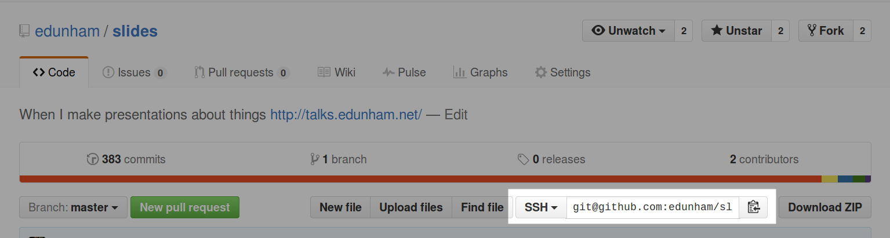

===============
Thinking in Git
===============

.. note::

    Additional Resources:

    https://github.com/github/training-kit
    http://justinhileman.info/article/git-pretty/git-pretty.png
    http://www.ndpsoftware.com/git-cheatsheet.html
    https://github.com/k88hudson/git-flight-rules
    http://githut.info/ for finding repos by language on gh
    https://github.com/tomheon/git_by_a_bus cool analytics
    http://visualize-your-git.herokuapp.com/
    http://tom.preston-werner.com/2009/05/19/the-git-parable.html

Hi
==

* Emily Dunham
* edunham on irc.freenode.net
* edunham@edunham.net
* @qedunham

.. note::

    Git is the most popular source code management and version control system in
    the open source community. Its complexity and power make it the best choice
    for most projects, while simultaneously giving it a daunting learning curve
    for newcomers. This talk will assume no background knowledge of version
    control, and will teach the basics of Git and GitHub in order to give you an
    accurate mental model of what the tool does, and help you fix mistakes then
    ask the right questions if you run into problems using it later.

Agenda
======

.. figure:: _static/gitlogo.png
    :align: right

* How to look at software development
* What's Git?
* Essential Git concepts & commands
* GitHub
* Demo!

.. note::

    You won't memorize all the commands in 2 hours but this will help you ask
    the right questions.

Thinking about Software Development
===================================

* Changing files
    * Some changes manual, other changes automatic
    * Changes for different reasons
        * Add feature, fix bug, test idea
        * Sometimes have several reasons at once, want changes separate

.. figure:: _static/compiling.png
    :align: right
    :scale: 50%

Why version control?
====================

.. figure:: _static/phdcomic.gif
    :align: center
    :scale: 50%

How do you track changes?
=========================

.. figure:: _static/deskdisaster.jpg
    :align: center
    :scale: 75%

Goals of Distributed Version Control
====================================

.. figure:: _static/dvcs.gif
    :align: right
    :scale: 30%

* Get the same file out that you put in
* Work in parallel with others
* Recombine individual work into one project
* Track and quantify changes over time

Using Git
=========

    http://www.craftychild.com/finger-painting.html

.. note::

    We're going to talk about a lot of commands now.

    Don't be afraid. Don't expect to know everything at first.

    These slides are online; the link will show up again at the end.

Setting Up
----------

* Tell Git who you are::

  $ git config --global user.name "John Doe"
  $ git config --global user.email johndoe@example.com

* You'll need SSH keys later
    * ``ssh-keygen -t rsa -b 2048``, or
    * ``ssh-keygen -t ecdsa``

* Install Git (also tk and tcl if you want the GUI)

* Set preferred editor
    * ``export GIT_EDITOR=vim`` in ``~/.bashrc`` or equivalent

* Pick a project to work on

.. note::

    The name and email you tell Git will be visible to everyone you share your
    commits with. If you use a public GitHub repo, that's the entire world.

    ECDSA -- elliptic-curve digital signature
    algorithm -- gives much smaller keys with comparable security

    GitHub can handle ECDSA, GitLab only does RSA as of 5.1.0

Imagine...
==========

    You can time travel through the history of any project!

.. note::

    This assumes that you have some number of projects you work on, each one
    has a history of changes, and those histories are tracked separately. A
    *repository* is the basic unit of a directory whose changes we want to
    track.

What's a **repository**?
========================

.. figure:: _static/filmstrip.png
    :align: center

Database of snapshots of your code

Universe whose history you can travel through

Getting a repo
--------------

.. code-block:: bash

    $ git init # Make a brand new repo

    $ git clone <git clone url> # Start with a copy of another

    # git@github.com:organization/reponame.git
    # https://github.com/organization/reponame.git

Looking at a repo
-----------------

.. code-block:: bash

    $ ls .git/

    $ git show
    fatal: bad default revision 'HEAD'
    # To be expected with nothing in the repo

    $ git show
    fatal: Not a git repository (or any of the
           parent directories): .git
    # not in a repo

    $ git log

Undo repository creation
------------------------

.. warning::
    This deletes your history. Only do it if you really want to stop
    having a Git repo here.

.. code-block:: bash

    $ rm -rf .git

.. figure:: _static/kaboom.jpg
    :align: center

Imagine...
==========

    What if you had to publish every change as soon as you made it?

How Git sees your project
=========================

Unstaged | Staged | Committed

.. figure:: _static/staging.png
    :align: center

.. note::

    It would be simpler to understand the system if we only let you commit one
    file at a time, but it's more important to have total control of what
    changes go into what commit.

    Git gives you a staging area where you can get a set of changes just
    right, before setting them in stone.

Imagine...
----------

    You decide exactly where time travelers are allowed to land.

What're **staged changes**?
===========================

.. figure:: _static/staging.png
    :align: center
    :scale: 75%

* Think "backstage", changes "waiting in the wings"

* Files or parts of files can be added or removed

Staging changes
---------------

.. figure:: _static/thewings.jpg
    :align: center

.. code-block:: bash

    $ echo "hello Great Wide Open" > foo
    $ git add foo

Looking at staged changes
-------------------------

.. code-block:: bash

    $ touch bar
    $ git status
    On branch master

    Initial commit

    Changes to be committed:
      (use "git rm --cached <file>..."
       to unstage)
        new file:   foo
        Untracked files:
          (use "git add <file>..." to include
           in what will be committed)
            bar
    $ git commit --dry-run

Undo?
-----

* Keeping uncommitted changes

.. code-block:: bash

    $ git rm --cached foo

* Go back to the latest committed version

.. code-block:: bash

    $ git reset HEAD foo

Imagine...
----------

    Time travelers get some signs and instructions when they arrive

.. note::

    Staging changes is all about deciding exactly what state it should be easy
    to go back to. Creating a commit adds some useful metadata to a snapshot
    of your repository.

Thinking about snapshots
========================

.. figure:: _static/polaroid.jpeg
    :align: right
    :scale: 30%

* Changes to a file plus pointers to unchanged files
* Each snapshot knows the state of all tracked files
* More efficient than just copying

.. figure:: _static/snapshots_model.png
    :align: center
    :scale: 70%

What's a **commit**?
====================

snapshot of changes, author, date, committer (can differ from author), parent commit

.. figure:: _static/snapshots_model.png
    :align: center

Making a commit
---------------

.. figure:: _static/tardis.jpg
    :align: right
    :scale: 50%

.. code-block:: bash

    $ git commit

.. code-block:: bash

    $ man git-commit
    -a, --all
    -i, --interactive
    --reset-author
    --date=<date> (see DATE FORMATS in man page)
    --allow-empty
    --amend
    -o, --only
    -S, --gpg-sign

.. note::
    -o is for *only files from command line* disregarding the stash
    Specifying file names disregards staged changes, plus stages all current
    contents

Looking at commits
------------------

.. figure:: _static/gitk.png
    :align: center
    :scale: 40%

.. code-block:: bash

    # details on latest or specified
    $ git show

    # Summary of recent, or a range
    $ git log

    $ man gitrevisions # ranges

What about commits per file?

.. code-block:: bash

    $ git blame <file>

Commit display options
----------------------

.. code-block:: bash

    $ git show

    $ git show --oneline

    # see PRETTY FORMATS section of
    $ man git-show

    # Check the GPG signature
    $ git show --show-signature

    # Want a GUI?
    $ gitk

Undo?
-----

.. code-block:: bash

    # just one file
    $ git checkout <commit> <filename>
    $ git add <filename>
    $ git commit -m "i put that file back how it was"

Or undo the whole commit

.. code-block:: bash

    $ git revert <commit to revert to>

.. figure:: _static/tardis2.jpg
    :scale: 50%
    :align: center

.. note::

    next: remotes
    Reverting makes a revert commit.
    Reversability > hiding mistakes

Imagine...
==========

    Time travelers get a list of especially interesting locations to visit

What's a **tag**?
=================

.. figure:: _static/graffiti.jpg
    :align: right
    :scale: 40%

* Marker attached to a specific commit
* Typically used for version or release number

.. figure:: _static/tags.png
    :scale: 130%

Adding a Tag
------------

.. figure:: _static/bookmarks.jpg
    :align: center
    :scale: 50%

.. code-block:: bash

    $ man git-tag
    $ git tag -m <msg> <tagname>

Default is lightweight tag -- just a reference for SHA-1 of latest commit

Pass ``-s`` or ``-u <key-id>`` to GPG-sign

Looking at Tags
---------------

|

.. code-block:: bash

    # List all available tags
    $ git tag

    # List tags matching regex
    $ git tag -l 'regex'

    # I want this version!
    $ git checkout <tag name>

Undo?
-----

|

.. code-block:: bash

    $ git tag -d <tagname>

    # And remove it from a remote repo
    $ git push origin :refs/tags/<tagname>

Imagine...
==========

    You can work on separate sets of changes that don't affect each other

What's a **branch**?
====================

.. figure:: _static/gitflow_branches.png
    :align: center

A parallel path of development, starting from a commit that's in the tree

.. note:: Point out why the arrows are "backwards"

Making a branch
---------------

.. code-block:: bash

    # track remote branch by default if one matches
    $ git checkout -b <branchname>

    # Shorthand for:
    $ git branch <branchname>   # create
    $ git checkout <branchname> # check out

    # Pushing a branch to a remote
    $ git push <remotename> <branchname>

Looking at branches
-------------------

|

.. code-block:: bash

    $ git branch

    $ git show <branchname>

|

.. figure:: _static/branchgraph.png
    :align: center

.. note::

    GitHub's "network" graph and gitk are good for this

Undo?
-----

.. figure:: _static/pruning_bonsai.jpg
    :align: right
    :scale: 80%

.. code-block:: bash

    # delete only if fully merged
    $ git branch -d

    # Delete, I Don't care what I lose
    $ git branch -D

    # delete remote branch
    $ git push <remotename> :<branchname>

Imagine...
==========

    Someone else could work on the same repo in a parallel universe

.. note::

    Whenever you get multiple people working on the same project, they'll want
    to make different changes and then bring them back together. To do this,
    Git needs to let history continue in two different directions and then
    bring the changes from each back together.

What's a **remote**?
====================

|

.. figure:: _static/remotes.png
    :scale: 50%
    :align: right

Another *clone* of more or less the same repo

(remember when we cloned to get a copy?)

|

.. figure:: _static/sheepclones.jpg
    :scale: 75%

Adding a Remote
---------------

|

.. code-block:: bash

    $ man git-remote

    $ git remote add <name> <url>

|

.. figure:: _static/remotes.jpg
    :align: center

Looking at Remotes
------------------

.. code-block:: bash

    $ git config -e

    # OR

    $ git remote show <name>

From one of my git configs...

.. code-block:: shell

    [remote "origin"]
      url = git@github.com:monte-language/monte.git
      fetch = +refs/heads/*:refs/remotes/origin/*
    [remote "edunham"]
      url = git@github.com:edunham/monte.git
      fetch = +refs/heads/*:refs/remotes/edunham/*

Undo?
-----

Do you prefer text editor...

.. code-block:: bash

    $ git config -e
    # delete or change remote

... or commands?

.. code-block:: bash

    $ man git-remote
    $ git remote rename <old> <new>
    $ git remote remove <name>

.. note:: "Undoing" push to remote is... trickier
    next: tags

What's a **merge**?
===================

* Brings changes from one branch to another

.. figure:: _static/pdx.jpe
    :align: center
    :scale: 80%

.. note::

    "a group of developers is called a merge conflict"

Making a Merge
--------------

.. code-block:: bash

    # Branch you're changing
    $ git checkout mywork

    $ git merge master

    # Merge conflicts?
    $ git status
        On branch mywork
        You have unmerged paths.
          (fix conflicts and run "git commit")

.. figure:: _static/merge.png
    :align: center
    :scale: 50%

.. note:: COMMIT OR STASH CHANGES FIRST

Merge Conflicts
---------------

|

.. code-block:: shell

    <<<<<<< HEAD
    This content was in mywork but not master
    =======
    This content was in master but not mywork
    >>>>>>> master

* Replace all that stuff with what the content *should* be.

* ``git add`` the file.

* Check that you've got everything with ``git status``, then commit.

* Or consider ``git mergetool`` for an interactive option.

Looking at Merges
-----------------

|

.. code-block:: bash

    $ git diff <commit before> <merge commit>

    # before merging, see changes
    $ git log ..otherbranch
    $ git diff ...otherbranch
    $ gitk ...otherbranch

Undo?
-----

|

.. code-block:: bash

    $ git merge abort
    $ git reset --keep HEAD@{1}

What's a **rebase**?
====================

|

.. figure:: _static/billted.jpg
    :align: center

|

Changing history. Means others will have to force pull.

.. note:: Don't do this unless you know what you're doing... But here's how to
    know what you're doing.

Rebasing
--------

|

.. code-block:: bash

    $ git rebase -i <commit range>
                    HEAD~4
                    # last 4 commits

|

.. code-block:: bash

    # Oops I forgot to pull
    $ git pull --rebase

Looking at the rebase
---------------------

|

.. code-block:: shell

    # Rebase 1a20f51..147c812 onto 1a20f51
    #
    # Commands:
    #  p, pick = use commit
    #  r, reword = use commit, but edit the commit message
    #  e, edit = use commit, but stop for amending
    #  s, squash = use commit, but meld into previous commit
    #  f, fixup = like "squash", but discard this commit's log message
    #  x, exec = run command (the rest of the line) using shell
    #
    # These lines can be re-ordered; they are executed from top to bottom.
    #
    # If you remove a line here THAT COMMIT WILL BE LOST.

.. note::

    Make sure you have your git editor set!

Undo?
-----

|

I should never have done that

.. code-block:: bash

    $ git reset --hard ORIG_HEAD

|

I'm stuck in a broken rebase, get me out

.. code-block:: bash

    $ git rebase --abort

GitHub
======

.. figure:: _static/github.png
    :align: center

Not Exactly Git
===============

.. figure:: _static/github.png
    :align: right
    :scale: 20%

|

* Less distributed paradigm
* Git never told us who to trust
* Git doesn't care who you are

Watch `Linus's talk <https://www.youtube.com/watch?v=4XpnKHJAok8>`_ for more detail

Getting Started
---------------

https://github.com/join

* Use the same email as your git config

HTTP vs SSH Clones
------------------

|

.. code-block:: bash

    Permission denied (publickey).
    fatal: Could not read from remote
    repository.

    Please make sure you have the
    correct access rights and the
    repository exists.

HTTP clone prompts for username and password

SSH clone uses key from your account

Forking
-------

.. figure:: _static/forking.gif
    :align: center
    :scale: 150%

* Parallel repos (or possibly divergent)

Pull Requests
-------------

|

.. figure:: _static/pr-button.png
    :align: center

* Formalizes "Hi, please merge my changes"

Annoying Tricks
---------------

|

* Branches keep adding their content to PRs
* Group management and access rights
* No project license required

|

.. figure:: _static/gh-teams.png
    :align: center

Extra Features
--------------

* Wiki
* Gist
* Issue trackers
* Graphs
* Repo descriptions and automatic README display

Additional GitHub tricks
------------------------

* ``.github/CONTRIBUTING.md``
* ``.github/ISSUE_TEMPLATE.md``
* ``.github/PULL_REQUEST_TEMPLATE.md``
* ``README``
* Display test results on PRs

.. note::

    https://github.com/blog/2111-issue-and-pull-request-templates
    https://docs.travis-ci.com/user/pull-requests
    https://circleci.com/docs/fork-pr-builds
    http://help.appveyor.com/discussions/questions/203-auto-run-tests-on-pull-requests
    https://wiki.jenkins-ci.org/display/JENKINS/GitHub+pull+request+builder+plugin

Continuous Integration
======================

|

.. figure:: _static/jenkins.png
    :align: right
    :scale: 20%

.. figure:: _static/travis.png
    :align: left
    :scale: 150%

Playing Well With Others
========================

* Change history locally, never globally
    * Never force push (unless you have to)
* Focused commits with clear commit messages
* Follow project standards for branching, tagging, etc.

|

.. figure:: _static/communication_dalek.jpe
    :align: center
    :scale: 120%

Questions?
==========

|

* Emily Dunham
* edunham on irc.freenode.net
* edunham@edunham.net
* @qedunham

Other Stuff
===========

checkout
--------

|

.. code-block:: bash

    $ git checkout branch

point HEAD at the tip of the specified branch

.. code-block:: bash

    $ git checkout <revision> file

gitrevisions
------------

|

::

    $ man gitrevisions

* Commit hash
* Refname
   * ``HEAD^n`` is nth parent of tip of current branch
   * ``branchname~n`` is nth generation ancestor of that branch
* Regex on commit message
  * ``:/broken``
* ``revision``:``path``

git bisect
----------

Binary Search:

::

    git bisect start
    git bisect bad <commit>
    git bisect good <commit>
    git bisect next
    git bisect reset <commit>

git cherry-pick
---------------

    http://pixabay.com/en/cherry-sweet-cherry-red-fruit-167341/

.. code-block:: bash

    $ git checkout <branch that needs special commit>
    $ git cherry-pick <special commit from another branch>

git format-patch
----------------

.. code-block:: bash

    $ git format-patch origin/master
    0001-first-commit.patch
    0002-second-commit.patch

.. code-block:: bash

    # I wonder what this patch does
    $ git apply --stat 0001-first-commit.patch

    # Let's merge!
    $ git apply 0001-first-commit.patch

    # Does your project use signed-off-by?
    $ git am --signoff < 0001-first-commit.patch
