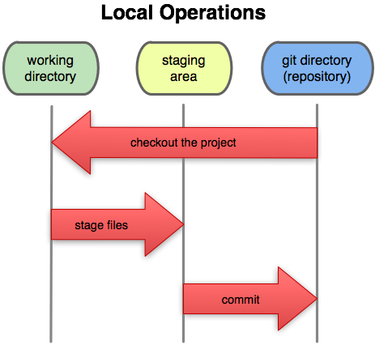
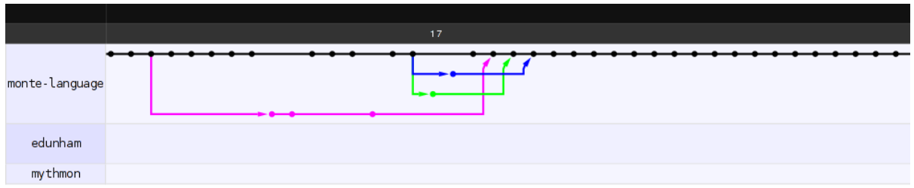
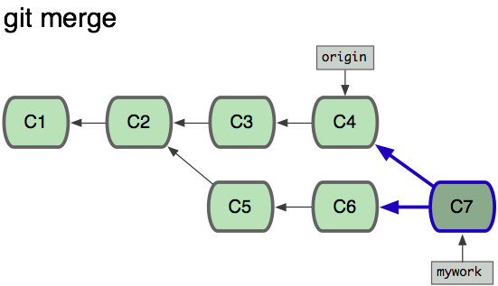

===============
Thinking in Git
===============

.. slide::

    "Git is the most popular source code management and version control system in
    the open source community. Its complexity and power make it the best choice
    for most projects, while simultaneously giving it a daunting learning curve
    for newcomers. This talk will assume no background knowledge of version
    control, and will teach the basics of Git in order to give you an accurate
    mental model of what the tool does, and help you fix mistakes then ask the
    right questions if you run into problems using it later."

    * Emily Dunham
    * edunham on irc.freenode.net and irc.cat.pdx.edu
    * edunham@osuosl.org
    
    .. note:: instead of a photo of me, you get a wall of text on what i'll
        teach you!

.. note:: probably ought to encorporate https://github.com/github/training-kit
    http://justinhileman.info/article/git-pretty/git-pretty.png
    http://www.ndpsoftware.com/git-cheatsheet.html
    mention bisect when talking about advanced undoing
    ... eventually.
    https://github.com/k88hudson/git-flight-rules
    http://githut.info/ for finding repos by language on gh
    https://github.com/tomheon/git_by_a_bus cool analytics
    http://visualize-your-git.herokuapp.com/
    
Agenda
======

.. figure:: _static/gitlogo.png
    :align: right

* How to look at software development
* What's Git
* How to learn it
    * Real life vs. tutorials
* Essential Git concepts & commands
* GitHub

Thinking about Software Development
===================================

* Changing files
    * Some changes manual, other changes automatic
    * Changes for different reasons
        * Add feature, fix bug, test idea
        * Sometimes have several reasons at once, want changes separate

.. figure:: _static/compiling.png
    :align: center
    :scale: 60%

Why version control?
====================

.. note:: TODO: pic of directory listing here instead

.. figure:: _static/phdcomic.gif
    :align: center
    :scale: 75%

Types of version control
========================

* Formal vs. impromptu
* Scalable vs. too much work
* Centralized vs. decentralized
* Concurrent vs. locking
* Diffs/patches vs. snapshots

.. figure:: _static/deskdisaster.jpg
    :align: center
    :scale: 75%

Goals of Distributed Version Control
====================================

* Reliability
* No SPOF
* Eliminate network dependencies

.. note:: reliability means put one file in, get same file out again,
    guaranteed. spell out Single Point of Failure.

Git's buzzwords
===============

* Decentralized
* Distributed
* Data assurance
* Porcelain vs Plumbing
* FOSS (GPLv2)

.. note:: We'll get to branches later... but you've noticed people saying
    oddly horticultural things like branches and trunks

How Git sees your project
=========================

.. note:: Unstaged | Staged | Committed

Using Git
=========

Setting Up
----------

* Tell Git who you are::

  $ git config --global user.name "John Doe"
  $ git config --global user.email johndoe@example.com

* You'll need SSH keys later
    * ``ssh-keygen -t rsa -b 2048``
    * ``ssh-keygen -t ecdsa``

* Install Git
    * also tk and tcl if you want the GUI later

* Set preferred editor
    * ``export GIT_EDITOR=vim`` in ``~/.bashrc`` or equivalent

* Pick a project to work on

.. note:: ECDSA is the new hotness -- elliptic-curve digital signature
    algorithm -- much smaller keys have comparable security

    * GitHub can handle ECDSA, GitLab only does RSA as of 5.1.0

What's a **repository**?
========================

.. figure:: _static/filmstrip.png
    :align: center

Database of snapshots of your code

.. code-block:: bash

    $ ls .git/

Getting a repo
--------------

.. code-block:: bash

    $ git init

    $ git clone <git clone url>

    # git@github.com:organization/reponame.git
    # https://github.com/organization/reponame.git

Looking at a repo
-----------------

.. code-block:: bash

    $ git show
    fatal: bad default revision 'HEAD'
    # To be expected with nothing in the repo

    $ git show
    fatal: Not a git repository (or any of the
           parent directories): .git
    # not in a repo

    $ git log

Undo?
-----

.. warning::
    This deletes your history. Only do it if you really want to stop
    having a Git repo here.

 .. code-block:: bash

    $ rm -rf .git

.. figure:: _static/kaboom.jpg
    :align: center

What're **staged changes**?
===========================

* Staging area is like backstage -- decide what changes go into your snapshot

* Files or parts of files can be added or removed

Staging changes
---------------

.. figure:: _static/thewings.jpg
    :align: center

.. code-block:: bash

    $ touch foo
    $ git add foo

Looking at staged changes
-------------------------

.. code-block:: bash

    $ touch bar
    $ git status
    On branch master

    Initial commit

    Changes to be committed:
      (use "git rm --cached <file>..."
       to unstage)
        new file:   foo
        Untracked files:
          (use "git add <file>..." to include
           in what will be committed)
            bar
    $ git commit --dry-run

Undo?
-----

* Keeping uncommitted changes

.. code-block:: bash

    $ git rm --cached foo

* Go back to the latest committed version

.. code-block:: bash

    $ git reset HEAD foo

.. note:: next, snapshots

Thinking about snapshots
========================

.. figure:: _static/polaroid.jpeg
    :align: right
    :scale: 50%

* Represented as changes to a file plus pointers to unchanged files
* Not a diff (tracks all files)
* Not a duplicate of everything (points to unchanged files)

.. figure:: _static/snapshots_model.png
    :align: center
    :scale: 70%

.. note:: next, commits

What's a **commit**?
====================

Snapshot of changes

Includes snapshot (with pointers to unchanged files), author, date, committer
(can differ from author), parent commit

.. figure:: _static/snapshots_model.png
    :align: center

Making a commit
---------------

.. figure:: _static/tardis.jpg
    :align: right

.. code-block:: bash

    $ git commit

.. code-block:: bash

    $ man git-commit
    -a, --all
    -i, --interactive
    --reset-author
    --date=<date> (see DATE FORMATS in man page)
    --allow-empty
    --amend
    -o, --only
    -S, --gpg-sign

.. note::
    -o is for *only files from command line* disregarding the stash
    Specifying file names disregards staged changes, plus stages all current
    contents

Looking at commits
------------------

.. figure:: _static/gitk.png
    :align: center
    :scale: 40%

.. code-block:: bash

    # details on latest or specified
    $ git show

    # Summary of recent, or a range
    $ git log

    $ man gitrevisions # ranges

What about commits per file?

.. code-block:: bash

    $ git blame <file>

Commit display options
----------------------

.. code-block:: bash

    $ git show

    $ git show --oneline

    # see PRETTY FORMATS section of
    $ man git-show

    # Check the GPG signature
    $ git show --show-signature

    # Want a GUI?
    $ gitk

Undo?
-----

.. code-block:: bash

    # just one file
    $ git checkout <commit> <filename>
    $ git add <filename>
    $ git commit -m "i put that file back how it was"

Or undo the whole commit

.. code-block:: bash

    $ git revert <commit to revert to>

Reverting makes a revert commit.

Reversability > hiding mistakes

.. figure:: _static/tardis2.jpg
    :scale: 50%
    :align: center

.. next:: remotes

What's a **remote**?
====================

|

.. figure:: _static/remotes.png
    :scale: 75%
    :align: right

Another *clone* of more or less the same repo

(remember when we cloned to get a copy?)

|

.. figure:: _static/sheepclones.jpg
    :scale: 75%

Adding a Remote
---------------

|

.. code-block:: bash

    $ man git-remote

    $ git remote add <name> <url>

|

.. figure:: _static/remotes.jpg
    :align: center

Looking at Remotes
------------------

.. code-block:: bash

    $ git config -e

    # OR

    $ git remote show <name>

From one of my git configs...

.. code-block:: shell

    [remote "origin"]
      url = git@github.com:monte-language/monte.git
      fetch = +refs/heads/*:refs/remotes/origin/*
    [remote "ed"]
      url = git@github.com:edunham/monte.git
      fetch = +refs/heads/*:refs/remotes/ed/*

Undo?
-----

Do you prefer text editor or commands?

.. code-block:: bash

    $ git config -e
    # delete or change remote

    $ man git-remote
    $ git remote rename <old> <new>
    $ git remote remove <name>
    ...etc.

.. note:: "Undoing" push to remote is... trickier
    next: tags

What's a **tag**?
=================

* Marker attached to a specific commit
* Typically used for version or release number

Adding a Tag
------------

.. code-block:: bash

    $ man git-tag
    $ git tag -m <msg> <tagname>

Default is lightweight tag -- just a reference for SHA-1 of latest commit

Pass ``-s`` or ``-u <key-id>`` to GPG-sign

Looking at Tags
---------------

|

.. code-block:: bash

    # List all available tags
    $ git tag

    # List tags matching regex
    $ git tag -l 'regex'

    # I want this version!
    $ git checkout <tag name>

Undo?
-----

|

.. code-block:: bash

    $ git tag -d <tagname>

    # And remove it from a remote repo
    $ git push origin :refs/tags/<tagname>

.. next:: branches

What's a **branch**?
====================

.. figure:: _static/gitflow_branches.png
    :align: center

A parallel path of development, starting from a commit that's in the tree

.. note:: Point out why the arrows are "backwards"

Making a branch
---------------

.. code-block:: bash

    # track remote branch by default if one matches
    $ git checkout -b <branchname>

    # Shorthand for:
    $ git branch <branchname>   # create
    $ git checkout <branchname> # check out

    # Pushing a branch to a remote
    $ git push <remotename> <branchname>

Looking at branches
-------------------

|

.. code-block:: bash

    $ git branch

    $ git show <branchname>

|

Undo?
-----

.. code-block:: bash

    # delete only if fully merged
    $ git branch -d

    # sudo delete
    $ git branch -D

    # delete remote branch
    $ git push <remotename> :<branchname>

What's a **merge**?
===================

* Converges the divergent branches

.. figure:: _static/pdx.jpe
    :align: center
    :scale: 80%

.. note:: TODO

    that joke about how a group of developers is called a merge conflict

Making a Merge
--------------

.. code-block:: bash

    # Branch you're changing
    $ git checkout mywork

    $ git merge master

    # Merge conflicts?
    $ git status
        On branch mywork
        You have unmerged paths.
          (fix conflicts and run "git commit")

.. note:: COMMIT OR STASH CHANGES FIRST

Merge Conflicts
---------------

|

.. code-block:: shell

    <<<<<<< HEAD
    This content was in mywork but not master
    =======
    This content was in master but not mywork
    >>>>>>> master

Replace all that stuff with what the content *should* be.

``git add`` the file.

Check that you've got everything with ``git status``, then commit.

Or consider ``git mergetool`` for a graphical option.

Looking at Merges
-----------------

|

.. code-block:: bash

    $ git diff <commit before> <merge commit>

    # before merging, see changes
    $ git log ..otherbranch
    $ git diff ...otherbranch
    $ gitk ...otherbranch

Undo?
-----

|

.. code-block:: bash

    $ git merge abort
    $ git reset --keep HEAD@{1}

What's a **rebase**?
====================

|

.. figure:: _static/billted.jpg
    :align: center

|

Changing history. Means others will have to force pull.

.. note:: Don't do this unless you know what you're doing... But here's how to
    know what you're doing.

Rebasing
--------

|

.. code-block:: bash

    $ git rebase -i <commit range>
                    HEAD~4
                    # last 4 commits

|

.. code-block:: bash

    # Oops I forgot to pull
    $ git pull --rebase

Looking at the rebase
---------------------

|

.. code-block:: shell

    # Rebase 1a20f51..147c812 onto 1a20f51
    #
    # Commands:
    #  p, pick = use commit
    #  r, reword = use commit, but edit the commit message
    #  e, edit = use commit, but stop for amending
    #  s, squash = use commit, but meld into previous commit
    #  f, fixup = like "squash", but discard this commit's log message
    #  x, exec = run command (the rest of the line) using shell
    #
    # These lines can be re-ordered; they are executed from top to bottom.
    #
    # If you remove a line here THAT COMMIT WILL BE LOST.

.. note:: Make sure you have your git editor set!

Undo?
-----

|

I should never have done that

.. code-block:: bash

    $ git reset --hard ORIG_HEAD

|

I'm stuck in a broken rebase, get me out

.. code-block:: bash

    $ git rebase --abort

GitHub Stuff
============

.. figure:: _static/github.png
    :align: right
    :scale: 80%

|

GH is not exactly Git.

* Less distributed paradigm
* Git never told us who to trust
* Git doesn't care who you are

Watch `Linus's talk <https://www.youtube.com/watch?v=4XpnKHJAok8>`_ for enlightenment

HTTP vs SSH Clones
------------------
|
.. code-block:: bash

    Permission denied (publickey).
    fatal: Could not read from remote
    repository.

    Please make sure you have the
    correct access rights and the
    repository exists.

HTTP clone prompts for username and password

SSH clone uses key from your account

Forking
-------

.. figure:: _static/forking.gif
    :align: center
    :scale: 150%

* Parallel repos (or possibly divergent)
* Act like the "center" of the centralized VCS

Pull Requests
-------------

|

.. figure:: _static/pr-button.png
    :align: center

* Formalizes "Hi, please merge my changes"

Annoying Tricks
---------------

|

* Branches keep adding their content to PRs
* Group management and access rights
* No project license required

|

.. figure:: _static/gh-teams.png
    :align: center

Extra Features
--------------

* Wiki
* Gist
* Issue trackers
* Cool graphs
* Repo descriptions and automatic README display

Continuous Integration
======================

|

.. figure:: _static/jenkins.png
    :align: right
    :scale: 25%

.. figure:: _static/travis.png
    :align: left
    :scale: 150%

Playing Well With Others
========================

* Change history locally, never globally
    * Never force push (unless you have to)
* Focused commits with clear commit messages
* Follow project standards for branching, tagging, etc.

|

.. figure:: _static/communication_dalek.jpe
    :align: center
    :scale: 120%

Questions?
==========
