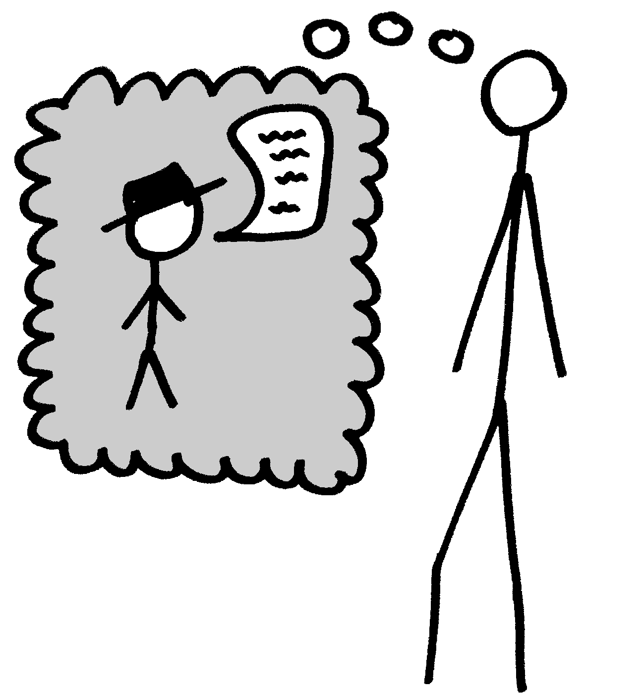

-------------
Human Hacking
-------------

.. note::

    Are you trying to herd cats as a project leader, or simply wondering how
    to evaluate a project's culture from the outside before getting involved?
    This talk explains some basic models of human motivation and behavior and
    include examples of applying them in the world of opensource software.
    As engineers, we use simple heuristics and algorithms for solving computer
    problems every day, although we rarely use those models to understand
    human interaction.

.. note:: 

    SERIOUSLY TYPE OUT THE STUPID TRANSITIONS ALSO FEATURE FREEZE LIKE A WEEK
    BEFORE PRESENTING

Introduction
------------

.. figure:: _drawn/hello.png
    :align: right
    :scale: 90%

|

talks.edunham.net/openwest2015/humans

edunham@edunham.net

github.com/edunham

Hieroglyph

.. note::

    i'm FOSS contributor, leader of stuff, student of psychology, also a
    student

    Slides are Hieroglyph, pictures sharpies -> phone camera -> Pinta

    I've found basic psych knowledge extremely helpful in FOSS and would like
    to share some theories that I find particularly interesting/applicable,
    and applications as both a contributor and a leader. 

Outline
-------

|

.. figure:: _drawn/outline.png
    :align: right
    :scale: 35%

* Theories
    * Individuals
    * Groups
* Applications
    * Contributor
    * Leader

.. note::
    1) theories about people                    (20mins)
        * theories about individuals    (~12min)
        * theories about groups         (~8min)
    2) applications as FOSS contributor         (15mins)
    3) Leadership                               (15mins)

    it's always hard to pick a starting point into a new curriculum but i've
    done my best

    these ideas are further from having objectively correct answers than most
    CS problems. i don't want you to blindly do as i say, but to ask better
    questions and learn what works for you

Individuals In Theory...
------------------------

.. figure:: _drawn/in_theory.png
    :align: center

.. note::

    discussing individuals in theory can include more detail on the facets of
    motivation and behavior...

You Live in a Human Emulator
----------------------------

.. figure:: _drawn/metacognition_grayscale.png
    :align: center
    :scale: 50%

.. note::

    this helps you predict the responses and behavior of people similar to
    yourself.

    do not assume it works correctly on people different from yourself.

    for instance, inviting conversation

    when do *you* feel safe approaching someone and then do it? give the
    situation those traits.

    * be present, calm, engaged in shared channels
    * subtly solve a problem of theirs

Personal Narrative
------------------

|

.. figure:: _drawn/narrative.png
    :align: center
    :scale: 50%

.. note::

    everyone has things they tell themself about what kind of person they are
    -- usually positive things. if you can pick up hints about what these
    things are, you can understand the person's motivation better.

    related, calling kids smart not necessarily as good as praising effort: 

    (growth mindset talk earlier at SCALE; find the video)

    (unfortunately paywalled) 
    http://psycnet.apa.org/index.cfm?fa=buy.optionToBuy&uid=1998-04530-003

    summary of same in NYT
    http://www.nytimes.com/1998/07/14/science/praise-children-for-effort-not-intelligence-study-says.html

Maslow
------

.. figure:: _drawn/maslow_grayscale.png
    :align: center
    :scale: 45%

.. note::

    it's a model of basic similarity between people in the needs they pursue,
    lower needs need to be met before higher ones can be sought

    useful question: what does someone hope by gain by doing a thing? pyramid
    is examples of the levels of abstraction at which you might find the
    answer.

    Sabu story: 2 foster daughters; behavior changes completely after arrest
    http://en.wikipedia.org/wiki/Hector_Monsegur
    http://www.bbc.com/news/technology-27579765

    I would be amazed if they *hadn't* threatened him...
    http://www.wired.com/2015/02/hacker-claims-feds-hit-44-felonies-refused-fbi-spy/

MBTI
----

.. figure:: _drawn/mbti.png
    :align: center
    :scale: 35%

.. note:: 

    **test is designed to force dichotomies**; during development tested
    thousands of questions to find those on which people statistically
    differentiate

          Extraversion vs Introversion "attitudes"
          Sensing vs Intuition -- percieving functions, what we do with
                                  information
          Feeling vs Thinking -- decision making functions
          Judging vs Percieving -- meta-types, J prefers order/predictable; P
                                   prefers spontaneous

    useful question: how do others' preferences for interaction affect the
    success of your involvement with them?

.. note:: maybe an image of the lawful/chaotic good/evil D&D matrix as well?

.. note::
    "The Forer effect... is the observation that individuals will give high
    accuracy ratings to descriptions of their personality that supposedly are
    tailored specifically for them, but are in fact vague and general enough
    to apply to a wide range of people." -- horoscope effect...

    Subjective validation occurs when two unrelated or even random events are
    perceived to be related because a belief, expectation, or hypothesis
    demands a relationship.

Cognitive Biases
----------------

.. figure:: _drawn/bias.png
    :align: center
    :scale: 35%

.. note::
    these are to everyday life what fallacies are to debate

    deviations from what a "logical" person would do

    wikipedia has a big list

    http://en.wikipedia.org/wiki/List_of_cognitive_biases

    also accessibly (though perhaps less accurately) summarized i

    http://www.businessinsider.com/cognitive-biases-2013-8
    http://www.businessinsider.com/cognitive-biases-2014-6

    related: 

    http://psycnet.apa.org/psycinfo/2011-27261-001

Overconfidence/Underconfidence effects
--------------------------------------

.. figure:: _drawn/confidence.png
    :align: center
    :scale: 25%

.. note::

    overconfidence effects -- planning fallacy, tendency to overestimate rate
    of work or understimate time frames

    ie every software project ever

    dunning-kruger effect: skilled people have better perspective on what they
    don't know and assume low skill; low-skill gets illusory superiority

Great at Pattern Recognition
----------------------------

.. figure:: _drawn/patternmatch_grayscale.png
    :align: center
    :scale: 40%

.. note::

    this is why natural language processing and image recognition are such a
    huge challenge for computers, and why CAPCHAs kind of sort of almost still
    work for forcing a human spammer to fill them out.

    BUT it means we can apply patterns which aren't there, or which aren't
    correct in a given situation, and end up judgemental or jumping to the
    wrong conclusions

Priming
-------

|

.. figure:: _drawn/priming_colored.png
    :align: center
    :scale: 45%

.. note::

    along the lines of pattern recognition, priming is the effect where people
    perform how they're expecting to -- prime someone with stereotypes of
    efficiency and they work measurably faster, etc.

    useful question: notice where environment and context are priming for a
    given response

    lots of links to study summaries at:
    https://www.psychologytoday.com/basics/priming

    http://en.wikipedia.org/wiki/Priming_%28psychology%29

Bad at Multitasking
-------------------

.. note:: 

    http://news.stanford.edu/news/2009/august24/multitask-research-study-082409.html

    (http://www.pnas.org/content/106/37/15583)

    gender differences: http://www.biomedcentral.com/2050-7283/1/18

    context switches take effort, just like in the kernel

    worrying about whether you'll forget something fires an interrupt

    power of calendars
    consistency is important
    much more efficient to focus on one thing at a time, juggling multiple
    tasks is a lot of overhead and performance suffers

Groups in Theory...
-------------------

.. figure:: _drawn/groups_theory.png
    :align: center
    :scale: 50%

.. note:: 

    we'll get the scariest parts out of the way first.

Milgram Obedience
-----------------

.. figure:: _drawn/milgram.png
    :align: center
    :scale: 50%

.. note::

        Milgram's book Obedience to Authority ISBN 0-06-176521-X

        effect of *action when you'd expect inaction*

        Prod 1: please continue.

        Prod 2: the experiment requires you to continue.

        Prod 3: It is absolutely essential that you continue.

        Prod 4: you have no other choice but to continue.

        65% (two-thirds) of participants (i.e. teachers) continued to the
        highest level of 450 volts. All the participants continued to 300
        volts.

        18 variations of his study.  

        summary with video: 
        http://www.simplypsychology.org/milgram.html

        virtual representation, observes that humans empathize with an avatar
        and obey authority to shock it anyway
        http://journals.plos.org/plosone/article?id=10.1371/journal.pone.0000039

        partial reproduction, stopping at 150V to avoid traumatizing
        participants, in 2009
        http://www.apa.org/pubs/journals/releases/amp-64-1-1.pdf

        and the replicated it on a fake French game show in 2010 and, surprise
        surprise, people zap others for TV authority too
        http://www.npr.org/templates/story/story.php?storyId=124838091

Bystander Effect
----------------

.. figure:: _drawn/bystander.png
    :align: center
    :scale: 40%

.. note::

    effect of *inaction when you'd expect action*

    presence of others decreases likelihood that individual will help
 
    ever seen what happens when a leader goes "somebody needs to do X"? we'll
    talk about mitigating bystander effect in leadership section.

    to mitigate: "YOU" do this, YOU do that... CPR training, same with
    delegation/leadership.

    KNOWING SOMETHIGN WILL HAPPEN == KNOWING WHO WILL DO IT

    Somebody Else's Problem field, or SEP, is a cheap, easy, and staggeringly
    useful way of safely protecting something from unwanted eyes. It can run
    almost indefinitely on a flashlight/9 volt battery, and is able to do so
    because it utilizes a person's natural tendency to ignore things they
    don't easily accept, like, for example, aliens at a cricket match. Any
    object around which a S.E.P is applied will cease to be noticed, because
    any problems one may have understanding it (and therefore accepting its
    existence) become Somebody Else's. An object becomes not so much invisible
    as unnoticed.

    meta-analysis: 
    http://www.ncbi.nlm.nih.gov/pubmed/21534650

Asch Conformity
---------------

.. figure:: _drawn/asch_colored.png
    :align: center
    :scale: 30%

.. note::

    this is the peer pressure thing -- people tend to assume they're wrong
    when the group disagrees with them.

    Asch, S.E. (1951). Effects of group pressure on the modification and
    distortion of judgments. In H. Guetzkow (Ed.), Groups, leadership and
    men(pp. 177--190). Pittsburgh, PA:Carnegie Press. 

    summary:
    http://www.integratedsociopsychology.net/asch_lines_experiment.html

    newer analyses: 

    http://psycnet.apa.org/journals/mon/70/9/1/

    age differences: 
    http://www.ncbi.nlm.nih.gov/pubmed/10224640

    http://www.radford.edu/~jaspelme/_private/gradsoc_articles/individualism_collectivism/conformity%20and%20culture.pdf

Social Scripts
--------------

|

.. figure:: _drawn/npc.png
    :align: center
    :scale: 60%

.. note:: get help with scripts example

Reciprocity
-----------

.. figure:: _drawn/reciprocity.png
    :align: center
    :scale: 30%

.. note:: attribution error fallacy, assumption that helps you -> likes you

Mirroring / Body Language
-------------------------

.. figure:: _drawn/mirroring.png
    :align: center
    :scale: 40%

.. note::

    can you tell if they're interested in talking to one another?

    they're lines on a page!

    this is pattern recognition and recognition of *mirroring* -- when people
    are interested in something they lean in, open posture, etc. disinterested
    or defensive, closed posture, turn away, etc.

    http://www.ted.com/talks/amy_cuddy_your_body_language_shapes_who_you_are?language=en

The Disclaimers
---------------

.. figure:: _drawn/science.png
    :align: center
    :scale: 35%

.. note::

    turn ordinary experiences into learning about humans by:
    (be open-minded)
        * being observant
        * identifying and correcting for own biases (mood, perspective)

    what happened? (OBSERVATION)

    why did it happen? (HYPOTHESIS)

    how will changing the inputs change the output? (EXPERIMENT)

Getting What You Want
---------------------

|

.. figure:: _drawn/careful_wish.png
    :align: center
    :scale: 45%

.. note::
    what do you want? (if you don't know, try talking to Eliza)

    be careful what you wish for. Does it make life better or worse for
    others? If it's never happened before, get others feedback on whether it
    would be an improvement.

    If it'd harm others, examine whether your actual goal could be achieved
    some other way.

Use Your Words Carefully
------------------------

.. figure:: _drawn/wordchoice.png
    :align: center
    :scale: 50%

.. note::

    some terms imply a goal or a set of values, ie right/wrong, fair/unfair,
    good/bad. when using them, SPECIFY THE GOAL rather than trusting audience
    to guess what you were thinking.

.. note::
    recognize limitations of models

    generalizations useful for asking right questions, etc.

    differences != flaws, traits that're advantageous in some contexts are
    harmful in others.

    for instance in one ecosystem it's great to have lungs, another it's great
    to have gills. 

    never assume you have enough context. observe what parts of the story
    you've made up, assume they're wrong, and proceed accordingly.

Applications as a FOSS Contributor
----------------------------------

| 

.. note:: people are dumb, panicky animals quote was a REALLY GOOD transition

.. figure:: _drawn/as_a_contributor.png
    :align: center
    :scale: 50%

First Impressions
-----------------

.. figure:: _drawn/firstimpression.png
    :align: center
    :scale: 25%

.. note::
    (that bit about pattern recognition) identify which patterns you'll match
    non-ridiculous handle -- be especially cautious of negative implications
    about any group, because the code reviewer might well be in that group
    (even sports teams)

    conform to channel/list behavior
        storytime: gifs vs no gifs, UA vs Intel

    ask questions well

Asking Good Questions
---------------------

.. figure:: _drawn/madlibs.png
    :align: center 
    :scale: 30%

I want ____ to ___ in order to ____. At ____, I read that ____ which makes me
think that I should be able to get it to _____ by doing ______. But when I try
to ______, ______ happens instead. Please help me ______.

.. note:: shows that you read the docs and that will make them very happy,
    especially the person who wrote the docs.

    KNOW WHAT YOU WANT

    fit the pattern of contributors who've turned out to be useful

Body Language of Online Communication
-------------------------------------

.. figure:: _drawn/mirroring.png
    :align: left
    :scale: 35%

* nickname or address
* speech style
* grammar/punctuation

.. note::
    mirroring speech styles

    "Body language" of online communication:
        * sentence length/structure/punctuation ~= tone
        * word choice ~= style of dress or medium of meatspace comms (graffiti
          vs newsletter vs political speech)
        * presence/absence in IRC channel (rage quit = slamming door)
        * interrupting with offtopic or inane things ~= being fidgety and
          attention-seeking
        * typing super slowly ~= mumble or stutter
        * email address, handle, email sig ~= age, style of dress, gender

Effective Email
---------------

.. figure:: _drawn/email.png
    :align: center
    :scale: 50%

.. note::
    ditto the human emulator
    again look at your own inbox -- which important messages are still
    unanswered? why? because they're hard

    * use a good title
    * most people only see one ask per message
    * summarize w/ bullet points
    * anticipate questions -- know audience and purpose

Routes Into a Project
---------------------

.. figure:: _drawn/map_color.png
    :align: center
    :scale: 50%

.. note:: get out of dumb question free cards
    1) use it and fix a bug
    2) find a contributor you know and get mentored/introduced
    3) edunham's help with installdocs technique
    4) start your own project

Improving Docs
--------------

.. figure:: _drawn/write_docs.png
    :align: center
    :scale: 75%

.. note::
    For mega-karma just offer to do it yourself

    * first diagnose why they haven't been written already

        * not needed by target audience?

        * project doesn't care?

        * just not enough time / too much work (usually)?

    are you asking the right person?

    can/should you change project culture? (social influence)

They're Ignoring My PRs!
------------------------

.. figure:: _drawn/shun.png
    :align: center
    :scale: 35%

.. note::
    is your expectation realistic?

    what feedback have you gotten?

    where could you get some feedback?

    what's blocking them? can you help?

    the magic of "when shall I remind you..."

Social Hierarchies and Capital
------------------------------

.. figure:: _drawn/social_capital.png
    :align: center
    :scale: 50%

.. note::
    karma/popularity -- how do you judge others?

    DON'T LIE TO SOUND COOL
        * storytime: Google interviews if you rate yourself a 10 at a skill

    Making recommendations is a gamble of social capital, proportionate to the
    pain that'll ensue if the recommendation was wrong

Leadership
----------

.. note:: Leadership tends to happen to people who work hard, are reliable,
    and are bad at saying 'no'. Here's what I wish someone had told me back
    when I started leading groups of humans (usually engineers).

    http://www.huffingtonpost.com/liz-orsquo/cant-say-no-say-yes-instead_b_4583052.html

    the emulator thing: which leaders do you look up to? why?
|

.. figure:: _drawn/meritocracy.png
    :align: center
    :scale: 40%

.. note::

    currency is amount cared, often measured in lines of code.
    passion/enthusiasm etc.

Know Your Audience
------------------

.. figure:: _drawn/conferences.png
    :align: center
    :scale: 45%

.. note::
    goals, priorities, biases, culture, energy/time/resources

Group Culture
-------------

.. figure:: _drawn/groupculture.png
    :align: center
    :scale: 50%

.. note::                                                                       
    foster accountability -- CONSISTENCY                                        
                                                                                
    benefit of the doubt -- they chose best of percieved options. to change     
    future behavior, ADD MORE OPTIONS                                           
                                                                                
    empower... give people percieved buy-in, investment
    **you can't just say "our culture is going to be x". there's already one there.**

Diversity
---------

.. figure:: _drawn/diversity_grayscale.png
    :align: center
    :scale: 40%

.. note:: 
    IDENTIFY ASSUMPTIONS.

    who's "everybody"? make statements about "everybody" in your group then
    challenge each assumption

.. note:: 
    recognize the difference between wanting people who *think differently* and
    people who *look different*.

.. note::
    discrimination:

    just inconsistent enforcement of rules, or different rules for different
    people. priveledge == "private law". whether it's ok seems to be based on
    whether it uses a differnce that people can control -- ie commit bit for those
    with more code in the repo
                                                                                
    **Discrimination** is when the rules are enforced inconsistently, different 
    rules for different people. Priveledge literally means **private law**.     
                                                                                
    Prevent it by choosing rules that *can* be consistently applied to          
    everybody -- be careful of **assumptions** about hardware or monetary       
    resources, time zones and geographic constraints

Troll-Proofing
--------------

.. figure:: _drawn/notrolls_grayred.png
    :align: center  
    :scale: 35%

.. note::
    clear codes of conduct, clear expectations that reflect the community's
    standards

    buy-in from group on code of conduct

    communications on the record -- encourages you to behave better, as well

And If That Didn't Work
-----------------------

.. figure:: _drawn/trollconvo_uncolored.png
    :align: center
    :scale: 35%

.. note::
    don't make it worse

    if someone's unduly offended and just wants to make a scene, get them to
    propose rules that could be enforced equally on everyone (sometimes helps
    improve self-awareness)

Get Someone Out
---------------

.. note::
    LAST resort
    why aren't they able to play well with others?

    * path of least resistance?
    * insufficient information?

    avoid "right" and "wrong" -- all they'll do is alienate people and encourage
    you to make unidentified assumptions

    speaking of people getting out... / sucky parts of FOSS

Manage Burnout
--------------

.. figure:: _drawn/burnout.png
    :align: center
    :scale: 45%

.. note:: 
    dropped balls aren't noticed as much as you think; monitor own state carefully
    so burnout doesn't sneak up

    burnout.io

Delegation
----------

.. note:: 
    successful leadership is when everybody else does the work                  
                                                                                
    the bus problem (git-bus)

    EMPOWER minions
    knowing it'll happen == knowing who'll do it

.. figure:: _drawn/delegation_colored.png
    :align: center
    :scale: 40%

Delegation: Timing
------------------

.. figure:: _drawn/calendar.png
    :align: center
    :scale: 45%

Leadership Handoff
------------------

.. figure:: _drawn/delegation_colored.png
    :align: center
    :scale: 40%

.. note::
    start ASAP when you realize you'll need to

    makes life easier for YOU, not just newbie (automate yourself out of a job)
    
    madlibs of tasks, share responsibilities, "puppet" them for smoother
    transition if they're not confident yet, recognize their differences

Teaching
--------

.. note:: 

    how you learned it -> how you teach it

    even really well-taught info is useless if the audience lacks
    background/perspective

    RAISE HANDS:

        * depth-first search

        * Moore's Law

        * Turing Test

poll.edunham.net
----------------

Results
-------

|

What impression did the presenter get?

Was it accurate?

Know Your Audience
------------------

.. figure:: _drawn/conferences.png
    :align: center
    :scale: 45%

.. note::

    overconfidence effects, peer pressure / conformity effects, etc.

    A few gotchas about teaching:                                               
    * more KNOW YOUR AUDIENCE                                                   
    * people do not like embarrassing themselves or standing out                

Recap
-----

* You live in a human emulator.
* People are very good at matching patterns.
* People do things when they expect to get something they want.
* Knowing something will happen == knowing who will do it

Q&A
---

.. figure:: _drawn/hello.png
    :align: right
    :scale: 90%

|

talks.edunham.net/openwest2015/humans

edunham@edunham.net

github.com/edunham

Hieroglyph

The Anecdote Graveyard
----------------------

|

leveraging conferences
----------------------

.. figure:: _drawn/conferences.png
    :align: center
    :scale: 45%

.. note::
    hallway track

    when you get a business card, take notes

    FOLLOW-UP sets you apart

    when writing talk proposals, questions show that you know your audience

    stalk conference abstracts from past years to get a feel for tone

    for talks, more KNOW YOUR AUDIENCE -- do they prefer buzzwords, or data?
    Use cases, or test cases? Pictures, or code?

inviting conversation
---------------------

.. note::

    remember the part about living in a human emulator?

    we'll get into how to get a specific question answered from a project
    later; this is along the lines of generally making friends

    when do *you* feel safe approaching someone and then do it? give the
    situation those traits.

    * be present, calm, engaged in shared channels
    * subtly solve a problem of theirs

    storytime: trying to talk to linus at linuxcon vs plug

recognizing social norms
------------------------

.. figure:: _drawn/socialnorms.png
    :align: center
    :scale: 35%

.. note::
    lurk moar!

stalking skills
---------------

.. figure:: _drawn/stalkskills.png
    :align: center
    :scale: 60%

.. note:: 

    put free software or open source software or project name in search,
    use safesearch

    with the caveat that there are sometimes things you didn't want to know

    GitHub, IRC, social media

    news articles -- it's amazing what you learn by Googling somebody -- be
    prepared to feel like you invaded their privacy

    personal site/blog

    is their hostmask or email at custom domain?

Negotiation
-----------

.. note:: 

    roommate going "i don't know what salary to ask for"
    remember they won't give you OVER what you say
    but they can't really give you UNDER what THEY say
