=============
Human Hacking
=============

::
    Is the project of your dreams ignoring your pull requests? Do you need a
    way to convince other contributors to improve their documentation? Are you
    trying to herd cats as a project leader, or simply wondering how to
    evaluate a project's culture from the outside before getting involved?
    This talk will explain some basic principles of human motivation and
    behavior and include examples and story time about applying them in the
    world of open­source software. It will provide simple heuristics and
    algorithms for common sources of confusion about human interaction,
    explained in terms that will make sense to engineers.

.. slide::

    |

    .. figure:: _static/helloworld.jpg
        :align: center

    .. note:: 
        I'm an active open source contributor 

        , a leader of things 

        , and an amateur student of psychology

        , and incidentally and reluctantly still a student at OSU.

        Note that a lot of things I'm going to discuss are further from having
        objectively correct answers than many of the problems we're accustomed to
        discussing in the open-source world. 

        These ideas are almost impossible to communicate wihtout a bit of a spin toward
        the presenter's worldview. Please don't blindly follow, but think about
        whether taking my advice would make you happier and only follow it if it
        would.

Outline
-------

웃 => 웃웃 => 웃웃웃웃웃웃웃웃

.. note:: Writing this talk has shown me that introductory curricula in
    non-technical fields are just as hard to write as for technical ones. 

    Fully understanding the topic is a circular dependency of knowledge, so
    you have to pick the point with the fewest prerequisites and just jump
    in.

    This is the first time I've done this talk, so it may not be the best way
    to organize the information -- I'd love to hear your feedback at the end
    (I'll have my contact information on a slide). 

    But this time around, I'm starting with abstractions of techniques to
    understand and predict an individual human, then generalizing those to
    small group interactions, then to the large groups of open source
    projects, and then talking about some things I've learned in nearly a
    decade of leading engineers.

Theories
========

웃
==

Why do people do things?

.. note::
    Congratulations, you live in a human emulator! It helps you predict the
    reactions and behavior of people similar to yourself. 

    This can be a double-edged sword, because not everyone is the same.

Maslow
------

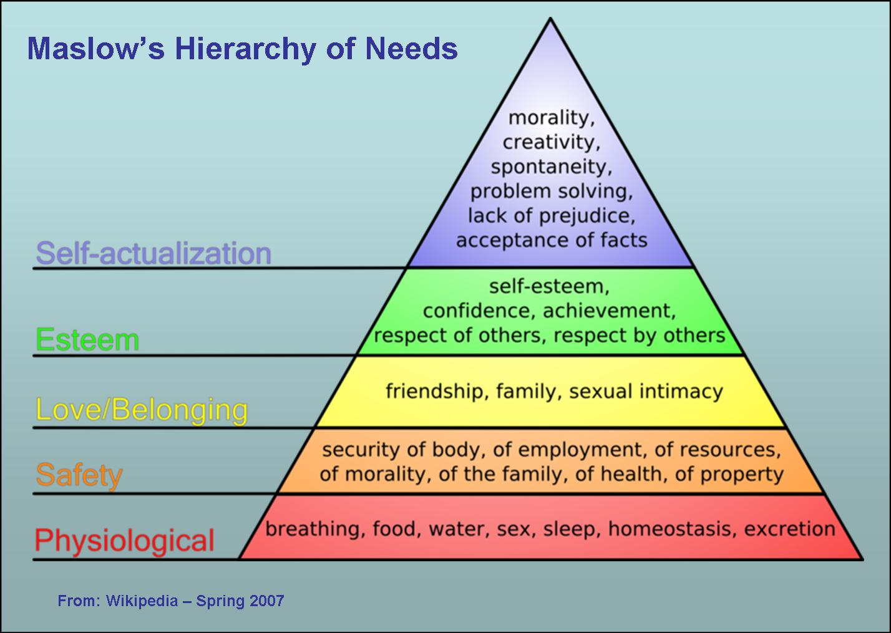

.. note:: 

    Here's a model of how people *are* more or less the same: basic needs.

    Lower needs need to be met before higher needs can be sought

MBTI types
----------

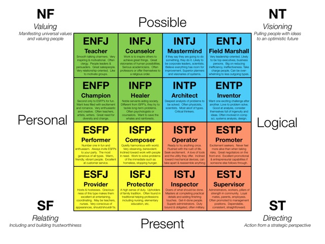

.. note:: Meyers-Briggs Type Indicator -- self-reported, seeks understanding

    Attitude: Extraversion vs Introversion

        Jungian interpretation. 
        Briggs and Myers recognized that each of the cognitive functions can
        operate in the external world of behavior, action, people, and things
        ("extraverted attitude") or the internal world of ideas and reflection
        ("introverted attitude"). 

   Functions: sensing/intuition (S/N) and thinking/feeling (T/F)

        1 of the 4 is dominant; this is shown by the J/P

        Sensing/Intuition: Information-gathering. **Sensing:** Present, tangible,
        concrete... **Intuition:** Abstract, theoretical, association-based.
        Meaning in theory/principles/patterns.
  

        Thinking/Feeling: Decision-making. **Thinking:** Rational,
        data-driven, logical, detached, rule-based, causal. **Feeling:**
        Association, empathy, consensus

    Lifestyle: Judging vs Percieving

        Extraverts: J/P is dominant function, Introverts it's auxilary

        Judging prefers thinking|feeling; Percieving prefers Sensing|Intuition
   
Priorities
----------

* Fast vs slow gratification
* **personal narrative/monolog**

.. note:: internal monolog goes with Dryack's story about Fred

Pop Quiz
========

|

Do you think that humans are mostly reasonable?

|

**rea·son·a·ble**

*ˈrēz(ə)nəb(ə)l/*

adjective
1. (of a person) having sound judgment; fair and sensible.
"no reasonable person could have objected"

.. note:: ha ha uhh NOOOOOO

Cognitive Biases
================

.. note:: 

    These are to everyday life what common fallacies are to logic

    Negative connotations but neither necessarily good nor bad, they just
    *explain*. 

    <the xkcd about breaking changes>

    impostor syndrome, dunning-kruger, etc. for tech... several slides
    that thing about asking favors

    <example of same "fallacy" being both good and bad>

.. figure:: _static/workflow.png
    :align: center

POP QUIZ
========

|

    Raise your hand if you think you're better at driving than the average 
    person in this room  

Overconfidence Effects
----------------------

|

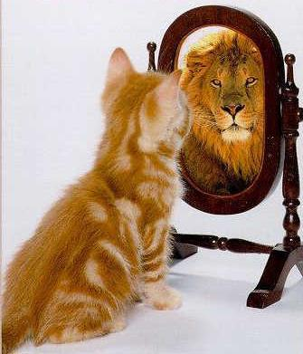

.. note::

    Overconficence effects -- Planning fallacy

    the tendency for people to overestimate their rate of work or to 
    underestimate how long it will take them to get things done.

    Ever tried to do time estimates on a software project?

POP QUIZ
========

|

    Raise your hand if you think you're better at coding than the average
    person in this room

Underconfidence Effects
-----------------------

|

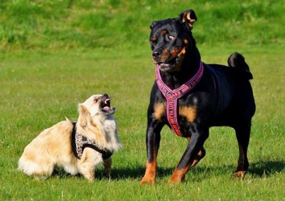

.. note::
    Underconfidence effects -- Dunning-Kruger

    The Dunning–Kruger effect is a cognitive bias manifesting in two principal
    ways: unskilled individuals tend to suffer from illusory superiority,
    mistakenly rating their ability much higher than is accurate, while highly
    skilled individuals tend to rate their ability lower than is accurate. 

Cognitive Biases...
-------------------

|

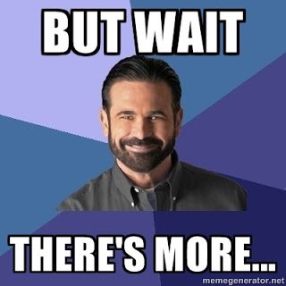

http://en.wikipedia.org/wiki/List_of_cognitive_biases

.. note:: We could talk about cognitive biases all day... but let's not.

Applications
============

.. slide::

    .. figure:: _static/sciencecat.jpg
        :class: scale
        :align: center
        :scale: 200%

    .. note:: 

        The attitude which turns ordinary interactions into useful leraning
        experiences is pragmatism, or being scientific
        pragmatism / science

        Being scientific == the approach required to get useful
        results from any "experiment" or time you change a cause to see how its
        effects are altered. 

        Next: Getting What You Want

    What happened?

    Why did it happen?

    How will changing the contributing factors change the results?

Getting What You Want
---------------------

|

.. note::
    My abstract is written in a way that will attract people who
    want to learn how to *get what they want* from others. 

    my "be careful what you wish for" is as follows: Identify what you want.
    Does it make life better or worse for you and the people around you? If
    it's unprecedented, get others' feedback on whether they'd see its results
    as an improvement. 

    If what you think you want is generally harmful, examine why you want it
    and whether that underlying desire could be satisfied through another
    course of action with fewer detrimental effects. 

    Next: Know what you want.

Getting... What?
================

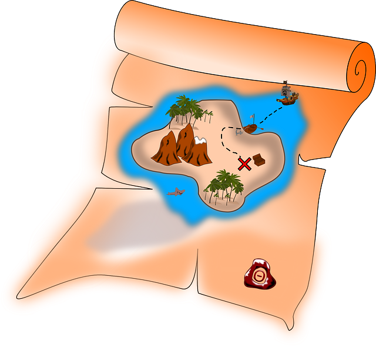

.. note::

    But "Be Careful what You Wish For" has a prerequisite:

    Step 0 is knowing what you want. If you don't
    konw what you want, I can't help you -- go spin up an instance of Elizabot
    and talk to her or something. What I regard as human hacking is mostly
    about channeling motivations and fulfilling desires, not about summoning
    that motivation out of thin air.

    Next: Outline

A word of warning
-----------------

.. note:: generalizations are useful because they help you ask the right
    questions and suggest what to look for
    
    Differences != flaws -- a trait that's a strength in one context is a
    weakness in another. 

    Never assume you have enough context -- if you want to say/do something
    that makes an assumption, look for a less assumptive way to phrase it or
    at least acknowledge that guess. Example: initial conversation w/ Dryack

웃웃
====

.. figure:: _static/tcas.png
    :align: center

.. note:: all of the factors that affect an individual's behavior are still
    relevant... 

Social Scripts
--------------

|

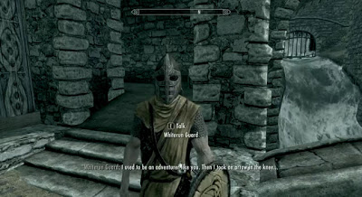

.. note:: 
    Kind of like conversations with NPCs in a video game

    helpful for dealing with anxiety -- get help from a friend who's good at
    handling a given situation to write out its script if you're nervous.
    They'll feel good... because people like helping others! Inner monolog:
    I'm a good friend because I help people in need...

Reciprocity
-----------

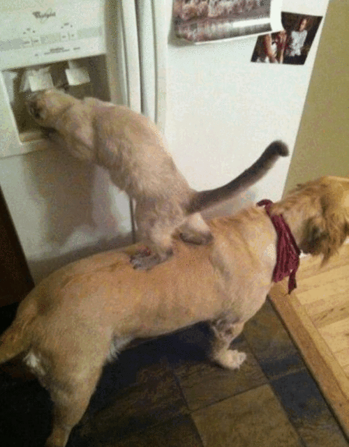
 

"He that has once done you a kindness will be more ready to do you another,
than he whom you yourself have obliged."
        - Benjamin Franklin

.. note::
    People like helping others! 

    Ben Franklin effect is extension of attribution error -- people observe
    themselves doing a thing and then make up a reason why it happened

    The Ben Franklin effect is a proposed psychological phenomenon: A person who
    has done or completed a favor for someone is more likely to do another favor
    for that person than they would be if they had received a favor from that
    person. Similarly, one who harms another is more willing to harm them again
    than the victim is to retaliate.

Body Language
-------------

.. note:: dominant/confident/aggressive vs submissive/uncertain/scared

    "Body language" of online communication: 
        * sentence length/structure/punctuation ~= tone
        * word choice ~= style of dress or medium of meatspace comms (graffiti
          vs newsletter vs political speech)
        * presence/absence in IRC channel (rage quit = slamming door)
        * interrupting with offtopic or inane things ~= being fidgety and
          attention-seeking
        * typing super slowly ~= mumble or stutter
        * email address, handle, email sig ~= age, style of dress, gender

Mirroring
---------

|

.. note:: 
    Hints at someone's communication style and priorities -- match their style

    most assume all others think/feel/prioritize the same way they do, until
    they learn otherwise

Inviting conversation
---------------------

|

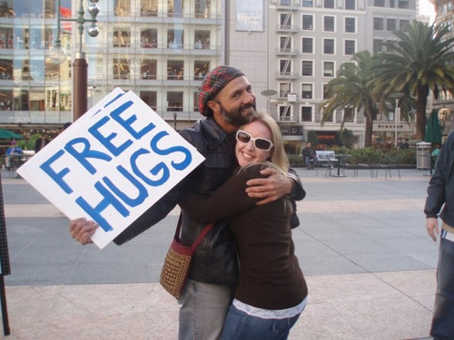

.. note:: 
    we'll get into how to get a specific question answered from a project
    later; this is along the lines of generally making friends

    when do *you* feel safe approaching someone and then do it? give the
    situation those traits. 

    * be present, calm, engaged in shared channels
    * subtly solve a problem of theirs

    storytime: trying to talk to linus at linuxcon vs plug

Effective email
---------------

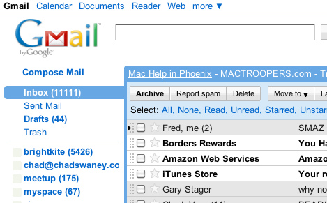

|

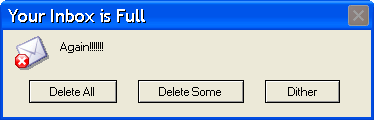

.. note:: 
    again look at your own inbox -- which important messages are still
    unanswered? why? because they're hard

    * use a good title
    * most people only see one ask per message
    * summarize w/ bullet points
    * anticipate questions -- know audience and purpose

Social Capital
--------------

|

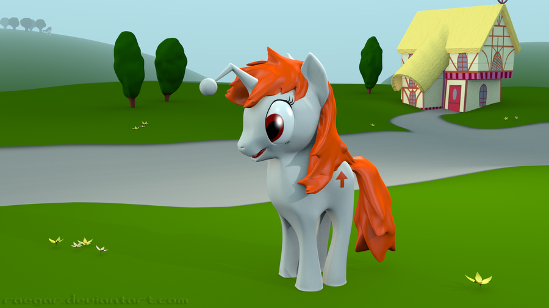

.. note:: 

    pony by raegar on deviantart :)

    karma, esteem, popularity, call it what you will

    Use your brain -- your built-in human emulator -- assess how you judge
    others

    DON'T LIE TO SOUND COOL
        * storytime: Google interviews if you rate yourself a 10 at a skill
    
    Making recommendations is a gamble of social capital, proportionate to the
    pain that'll ensue if the recommendation was wrong

Stalking Skills
---------------

.. note::
    GitHub

    IRC
    
    social media
    
    news articles -- it's amazing what you learn by Googling somebody -- be
    prepared to feel like you invaded their privacy
    
    personal site/blog
    
    is their hostmask or email at custom domain?

웃웃웃웃웃웃웃웃
================

.. figure:: _static/committee.jpg
    :class: scale

.. note:: Okay so now we have a whole BUNCH of people. no longer feasible to
    consider them as individuals...

    next: FOSS

.. slide::

    |

    .. figure:: _static/person_vs_people_quote.gif
        :align: center

FOSS
----

|

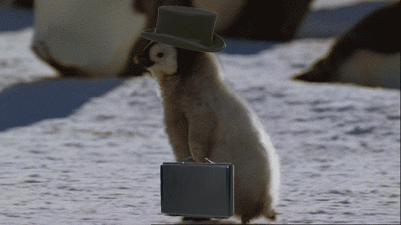

.. note::
    Meritocracy: Currency is fucks given measured in lines of code

    next: getting taken seriously

Getting Taken Seriously
-----------------------

.. note::
    non-ridiculous handle -- be especially cautious of negative implications
    about any group, because the code reviewer might well be in that group
    (even sports teams)

    conform to channel/list behavior
        storytime: gifs vs no gifs, UA vs Intel
    
    ask questions well

Asking Questions Well
---------------------

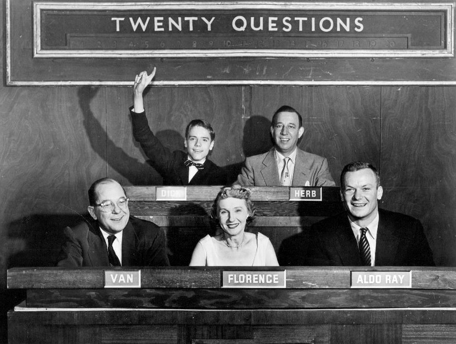

I want ____ to ___ in order to ____. At ____, I read that ____ which makes
me think that I should be able to get it to _____ by doing ______. But
when I try to ______, ______ happens instead. Please help me ______. 

.. note::
    KNOW WHAT YOU WANT  

    Format is "I wanted X; I did Y; I got Z"

Routes into a project
---------------------

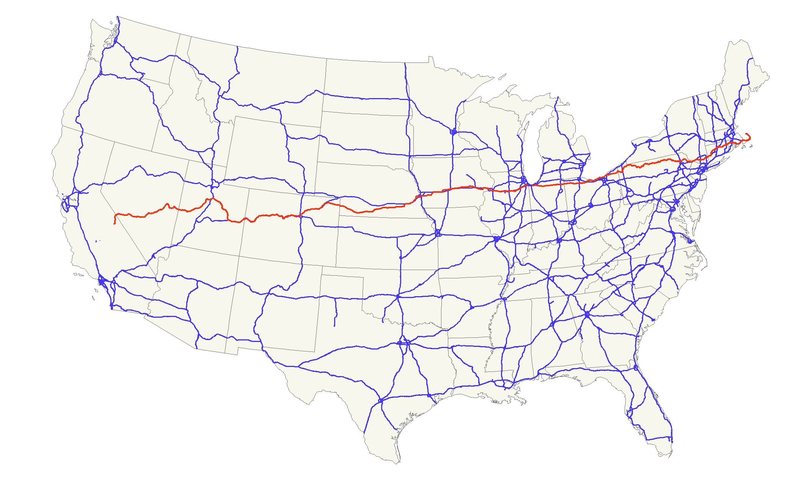

.. note::
    1) use it and fix a bug
    2) find a contributor you know and get mentored/introduced
    3) edunham's help with installdocs technique
    4) start your own project

Improving Docs
--------------

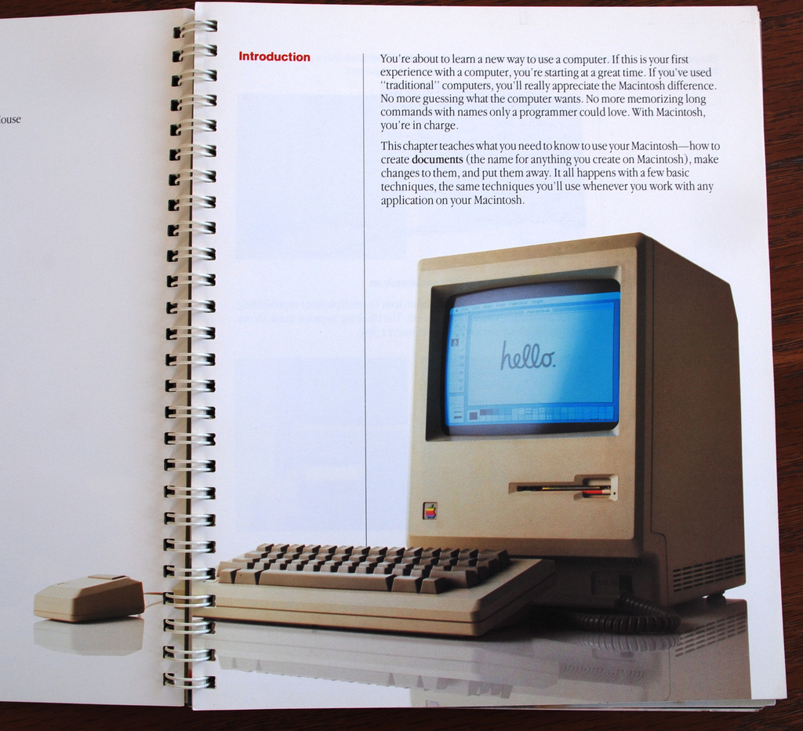

.. note::
    For mega-karma just offer to do it yourself
    
    * first diagnose why they haven't been written already

        * not needed by target audience?

        * project doesn't care?

        * just not enough time / too much work (usually)?

    are you asking the right person?

    can/should you change project culture? (social influence)

Route Around Damage
-------------------

|

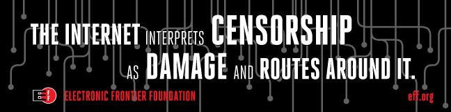

.. note::
    yes maybe it takes more effort; this means that you'll only do the things
    that're worth it

    storytime: pessimistic coworker and big new project idea (dobc)

Case study: They're ignoring my PRs!
------------------------------------

.. note::
    is your expectation realistic?

    what feedback have you gotten?

    where could you get some feedback?

    what's blocking them? can you help?

    the magic of "when shall I remind you..."

Leveraging Conferences
----------------------

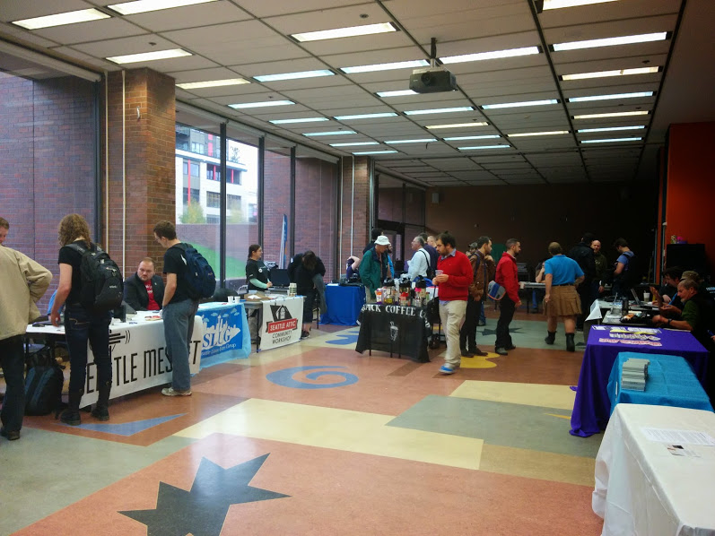

.. note::
    hallway track

    when you get a business card, take notes
    
    FOLLOW-UP sets you apart
    
    when writing talk proposals, questions show that you know your audience
    
    stalk conference abstracts from past years to get a feel for tone

    for talks, more KNOW YOUR AUDIENCE -- do they prefer buzzwords, or data?
    Use cases, or test cases? Pictures, or code?

Leadership
==========

.. note:: Leadership tends to happen to people who work hard, are reliable,
    and are bad at saying 'no'. Here's what I wish someone had told me back
    when I started leading groups of humans (usually engineers).

    http://www.huffingtonpost.com/liz-orsquo/cant-say-no-say-yes-instead_b_4583052.html

Know Your Audience
------------------

.. note::
    goals

    priorities
    
    biases

    culture

    energy/time/resources

Establishing Culture
--------------------

|

.. figure:: _static/petri.jpg
    :class: scale
    :align: center

.. note::
    foster accountability -- CONSISTENCY

    benefit of the doubt -- they chose best of percieved options. to change
    future behavior, ADD MORE OPTIONS
    
    empower... give people percieved buy-in, investment

    **Discrimination** is when the rules are enforced inconsistently, different
    rules for different people. Priveledge literally means **private law**.  

    Prevent it by choosing rules that *can* be consistently applied to
    everybody -- be careful of **assumptions** about hardware or monetary
    resources, time zones and geographic constraints

Delegation
----------

|

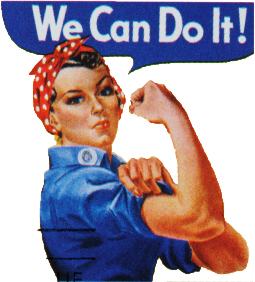

.. note:: 
    successful leadership is when everybody else does the work

    the bus problem (git-bus)
    
    EMPOWER minions vs DIY... what do you gain by burning yourself out?
    
    KNOW WHAT YOU WANT
    
    knowing it will happen == knowing who will do it

Managing Expectations
---------------------

.. note::
    pre-emptive strike with codes of conduct, clear expectations, etc.

    dropped balls are noticed a LOT less than perfect serves
    
        * good for managing own burnout

Experiment Time
---------------

TODO: FIXME: PICTURE AND POLL AND STUFF... science dog?

.. note::
    A few gotchas about teaching: 
    * more KNOW YOUR AUDIENCE
    * people do not like embarrassing themselves or standing out
    * you're all here because you're pretty knowledgeable about Linux, does
      anyone not know why we choose Linux over other operating systems? 
      * then an anonymous Google poll link
      * then we look at the poll results vs the presenter's impression of the
        room's knowledge

pre-emptive problem solving
---------------------------

.. note::
    clearly communicate expectations -- this includes being attentive to what
    the group wants its expectations to be
    
    Establish code of conduct early, enforce consistently
    COMMUNICATE about it --
    https://modelviewculture.com/pieces/a-code-of-conduct-is-not-enough

    get buy-in from group, leverage inner monolog (i'm a good contributor) to
    get public commitment to go along with rules once group votes

    don't make enemies; be careful with professional friendships because if
    you need to end them... yeah

    keep all communications on the record and remain beyond reproach

    if possible, don't feed the trolls

DFIU
----

|

.. note::
     don't leak information or make people feel unsafe -- don't make it worse

     storytime: EMT rules (find the patient, don't kill the patient...)
     
     **Discrimination** is when the rules are enforced inconsistently, different
     rules for different people. Priveledge literally means **private law**.  

And Yet...
----------

.. note:: 
    sometimes you do your best and yet it all goes to shit anyways.

    techniques: get someone who feels offended to propose a rule that could be
    enforced equally on everyone in the channel including them... asking them
    for help/input at least makes them feel included

    mirroring is super powerful for inciting self-awareness of behavior, but
    self-awareness does not necessarily inspire them to change and can in
    cases with self-hatred or w/e actually make things worse

Getting People Out
------------------

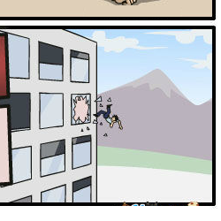

* Do not actually throw anyone out of any windows.

.. note::
    assess the situation. what's best for the rest of the group? if someone is
    causing drama for attention, how to avoid giving it to them?

    why aren't they doing something productive/useful with their life? 
        * insufficient information? can they be educated?
        * path of least resistance? increase resistance till they go troll
          someone else
    super important time to step back from perception that you're "right" and
    they're "wrong"

Avoiding Burnout
----------------

|

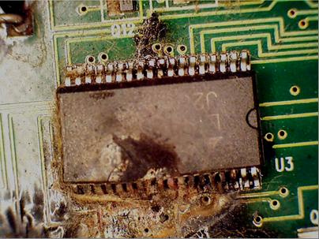

.. note::
    empower group
    realistic expectations
    forgive yourself

    http://burnout.io/ for more resources

Leadership Handoff
------------------

.. figure:: _static/baton.jpg
    :class: scale

.. note:: 
    madlibs version of common tasks

    canned responses
    
    share with newbie during transition
    
    mentor vs. walk away... 
    
    **diversity:** recognize that new leader does not work the same way you do,
    and that's good for the group -- work with them to use your handoff to
    make the next handoff easier

Mental health / brain bugs
--------------------------

.. figure:: _static/bug.jpg
    :class: scale

.. note::
    picture: original software bug

    read the CVE
    apply patches (usefully obtained from shrinks)
    unplugged machine is "secure" but useless

Questions?
==========

|

edunham on irc.freenode.net

dunhame@onid.orst.edu 

edunham@osuosl.org

.. note:: 
    disregard expectations of fairness
    eliciting information:
        * leverage traits we've talked about, desire to correct falsehoods,
          quid pro quo, etc
    social engineering
    do things that make you happy/motivated/inspired
