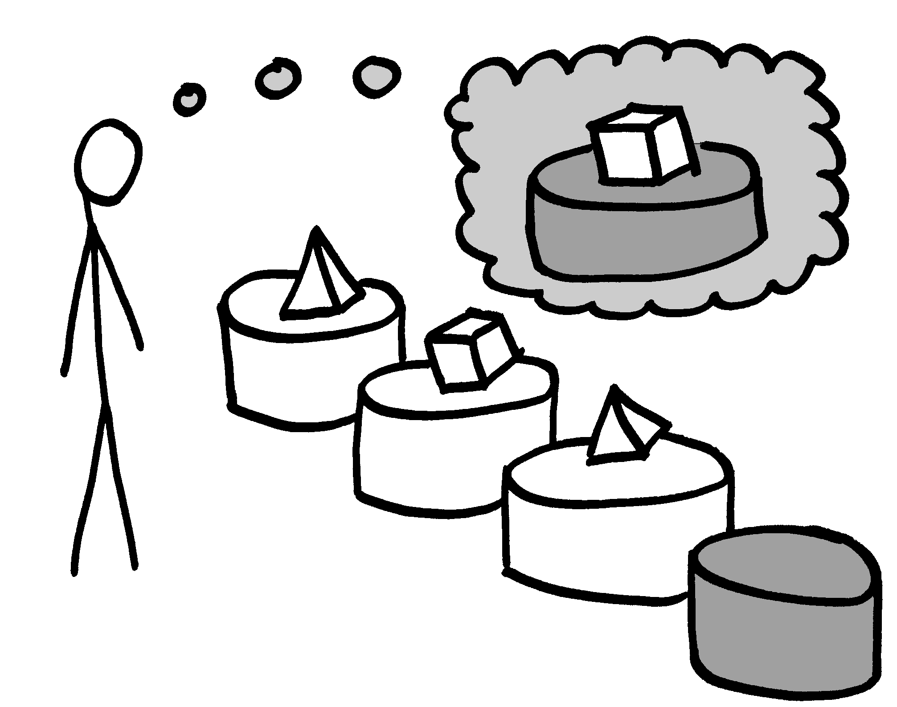

=============
Human Hacking
=============

.. note:: focuses...
    pacing
    no questionmarks
    transitions
    fight tendency to get shrill when nervous
    kill the "kind of" -- use synonyms
    "umm"
    less mbti
    accent gets stronger when joking
    BEST FRIEND or DAD thinks they're better at driving than averae
    git by a bus (for good culture stuff?)... delegation+redundancy
    transition into dropped ball was good
    good reiteration on burnout stuff -- goes so fast it needs more repetition
    fewer words on the "automate yourself out of a job" for handoffs

Introduction
------------

|

talks.edunham.net/SCALE2015

github.com/edunham

Hieroglyph

.. note::
    i'm FOSS contributor, leader of stuff, student of psychology, also a
    student

    Slides are Hieroglyph, pictures sharpies -> phone camera -> Pinta

Outline
-------

|

.. figure:: _drawn/outline.png
    :align: right
    :scale: 35%

* Theories
    * Individuals
    * Groups
* Applications
    * Contributor
    * Leader

.. note::
    1) theories about people                    (20mins)
        * theories about individuals    (~12min)
        * theories about groups         (~8min)
    2) applications as FOSS contributor         (15mins)
    3) Leadership                               (15mins)

    it's always hard to pick a starting point into a new curriculum but i've
    done my best

    these ideas are further from having objectively correct answers than most
    CS problems. i don't want you to blindly do as i say, but to ask better
    questions and learn what works for you

Individuals In Theory...
========================

.. figure:: _drawn/in_theory.png
    :align: center

.. note::

    discussing individuals in theory can include more detail on the facets of
    motivation and behavior...

You Live in a Human Emulator
----------------------------

.. figure:: _drawn/metacognition_grayscale.png
    :align: center
    :scale: 50%

.. note::

    this helps you predict the responses and behavior of people similar to
    yourself.

    do not assume it works correctly on people different from yourself.

    for instance, inviting conversation

    when do *you* feel safe approaching someone and then do it? give the
    situation those traits.

    * be present, calm, engaged in shared channels
    * subtly solve a problem of theirs

Personal Narrative
------------------

|

.. figure:: _drawn/narrative.png
    :align: center
    :scale: 50%

.. note::

    everyone has things they tell themself about what kind of person they are
    -- usually positive things. if you can pick up hints about what these
    things are, you can understand the person's motivation better.

Maslow
------

.. note::

    it's a model of basic similarity between people in the needs they pursue,
    lower needs need to be met before higher ones can be sought

    useful question: what does someone hope by gain by doing a thing? pyramid
    is examples of the levels of abstraction at which you might find the
    answer.

MBTI
----

.. figure:: _drawn/mbti.png
    :align: center
    :scale: 35%

.. note:: test is designed to force dichotomies; during development tested
    thousands of questions to find those on which people statistically
    differentiate

          Extraversion vs Introversion "attitudes"
          Sensing vs Intuition -- percieving functions, what we do with
                                  information
          Feeling vs Thinking -- decision making functions
          Judging vs Percieving -- meta-types, J prefers order/predictable; P
                                   prefers spontaneous

    useful question: how do others' preferences for interaction affect the
    success of your involvement with them?

.. note:: maybe an image of the lawful/chaotic good/evil D&D matrix as well?

.. note::
    "The Forer effect... is the observation that individuals will give high
    accuracy ratings to descriptions of their personality that supposedly are
    tailored specifically for them, but are in fact vague and general enough
    to apply to a wide range of people." -- horoscope effect...

    Subjective validation occurs when two unrelated or even random events are
    perceived to be related because a belief, expectation, or hypothesis
    demands a relationship.

Cognitive Biases
----------------

.. figure:: _drawn/bias.png
    :align: center
    :scale: 35%

.. note::
    these are to everyday life what fallacies are to debate

    deviations from what a "logical" person would do

    wikipedia has a big list

    TODO: LINK

Overconfidence/Underconfidence effects
--------------------------------------

.. figure:: _drawn/confidence.png
    :align: center
    :scale: 25%

.. note::

    overconfidence effects -- planning fallacy, tendency to overestimate rate
    of work or understimate time frames

    ie every software project ever

    dunning-kruger effect: skilled people have better perspective on what they
    don't know and assume low skill; low-skill gets illusory superiority

great at pattern recognition
----------------------------

.. note::

    this is why natural language processing and image recognition are such a
    huge challenge for computers, and why CAPCHAs kind of sort of almost still
    work for forcing a human spammer to fill them out.

    BUT it means we can apply patterns which aren't there, or which aren't
    correct in a given situation, and end up judgemental or jumping to the
    wrong conclusions

priming
-------

|

.. figure:: _drawn/priming_colored.png
    :align: center
    :scale: 45%

.. note::

    along the lines of pattern recognition, priming is the effect where people
    perform how they're expecting to -- prime someone with stereotypes of
    efficiency and they work measurably faster, etc.

    useful question: notice where environment and context are priming for a
    given response

    lots of links to study summaries at:
    https://www.psychologytoday.com/basics/priming

    http://en.wikipedia.org/wiki/Priming_%28psychology%29

Groups in Theory...
===================

Asch Conformity
---------------

.. figure:: _drawn/asch_colored.png
    :align: center
    :scale: 30%

.. note::

    this is the peer pressure thing -- people tend to assume they're wrong
    when the group disagrees with them.

    Asch, S.E. (1951). Effects of group pressure on the modification and
    distortion of judgments. In H. Guetzkow (Ed.), Groups, leadership and
    men(pp. 177--190). Pittsburgh, PA:Carnegie Press. 

    summary:
    http://www.integratedsociopsychology.net/asch_lines_experiment.html

    newer analyses: 

    http://psycnet.apa.org/journals/mon/70/9/1/

    age differences: 
    http://www.ncbi.nlm.nih.gov/pubmed/10224640

    http://www.radford.edu/~jaspelme/_private/gradsoc_articles/individualism_collectivism/conformity%20and%20culture.pdf

social scripts/expectations
---------------------------

|

.. note:: get help with scripts example

Milgram Obedience
-----------------

.. figure:: _drawn/milgram.png
    :align: center
    :scale: 50%

.. note::
        Milgram's book Obedience to Authority ISBN 0-06-176521-X

        virtual representation, observes that humans empathize with an avatar
        and obey authority to shock it anyway
        http://journals.plos.org/plosone/article?id=10.1371/journal.pone.0000039

        partial reproduction, stopping at 150V to avoid traumatizing
        participants, in 2009
        http://www.apa.org/pubs/journals/releases/amp-64-1-1.pdf

        and the replicated it on a fake French game show in 2010 and, surprise
        surprise, people zap others for TV authority too
        http://www.npr.org/templates/story/story.php?storyId=124838091

bystander effect
----------------

.. note::

    Somebody Else's Problem field, or SEP, is a cheap, easy, and staggeringly
    useful way of safely protecting something from unwanted eyes. It can run
    almost indefinitely on a flashlight/9 volt battery, and is able to do so
    because it utilizes a person's natural tendency to ignore things they
    don't easily accept, like, for example, aliens at a cricket match. Any
    object around which a S.E.P is applied will cease to be noticed, because
    any problems one may have understanding it (and therefore accepting its
    existence) become Somebody Else's. An object becomes not so much invisible
    as unnoticed.

    ever seen what happens when a leader goes "somebody needs to do X"? we'll
    talk about mitigating bystander effect in leadership section.

reciprocity
-----------

.. note:: attribution error fallacy, assumption that helps you -> likes you

mirroring / body language
-------------------------

.. figure:: _drawn/mirroring.png
    :align: center
    :scale: 40%

.. note::

    can you tell if they're interested in talking to one another?

    they're lines on a page!

    this is pattern recognition and recognition of *mirroring* -- when people
    are interested in something they lean in, open posture, etc. disinterested
    or defensive, closed posture, turn away, etc.

    http://www.ted.com/talks/amy_cuddy_your_body_language_shapes_who_you_are?language=en

Application Advice
==================

.. note:: just in general

doing science
-------------

.. note::

    turn ordinary experiences into learning about humans by:
    (be open-minded)
        * being observant
        * identifying and correcting for own biases (mood, perspective)

    what happened? (OBSERVATION)

    why did it happen? (HYPOTHESIS)

    how will changing the inputs change the output? (EXPERIMENT)

getting what you want
---------------------

|

.. note::
    what do you want? (if you don't know, try talking to Eliza)

    be careful what you wish for. Does it make life better or worse for
    others? If it's never happened before, get others feedback on whether it
    would be an improvement.

    If it'd harm others, examine whether your actual goal could be achieved
    some other way.

use your words carefully
------------------------

.. note::

    some terms imply a goal or a set of values, ie right/wrong, fair/unfair,
    good/bad. when using them, SPECIFY THE GOAL rather than trusting audience
    to guess what you were thinking.

.. note::
    recognize limitations of models

    generalizations useful for asking right questions, etc.

    differences != flaws, traits that're advantageous in some contexts are
    harmful in others.

    never assume you have enough context. observe what parts of the story
    you've made up, assume they're wrong, and proceed accordingly.

Applications
============

.. note::
    as a contributor

recognizing social norms
------------------------

.. figure:: _drawn/socialnorms.png
    :align: center
    :scale: 35%

.. note::
    lurk moar!

body language of online communication
-------------------------------------

.. figure:: _drawn/mirroring.png
    :align: left
    :scale: 35%

* nickname or address
* speech style
* grammar/punctuation

.. note::
    mirroring speech styles

    "Body language" of online communication:
        * sentence length/structure/punctuation ~= tone
        * word choice ~= style of dress or medium of meatspace comms (graffiti
          vs newsletter vs political speech)
        * presence/absence in IRC channel (rage quit = slamming door)
        * interrupting with offtopic or inane things ~= being fidgety and
          attention-seeking
        * typing super slowly ~= mumble or stutter
        * email address, handle, email sig ~= age, style of dress, gender

effective email
---------------

.. figure:: _drawn/email.png
    :align: center
    :scale: 50%

.. note::
    ditto the human emulator
    again look at your own inbox -- which important messages are still
    unanswered? why? because they're hard

    * use a good title
    * most people only see one ask per message
    * summarize w/ bullet points
    * anticipate questions -- know audience and purpose

social hierarchies and capital
------------------------------

.. figure:: _drawn/social_capital.png
    :align: center
    :scale: 50%

.. note::
    karma/popularity -- how do you judge others?

    DON'T LIE TO SOUND COOL
        * storytime: Google interviews if you rate yourself a 10 at a skill

    Making recommendations is a gamble of social capital, proportionate to the
    pain that'll ensue if the recommendation was wrong

stalking skills
---------------

.. note:: put free software or open source software or project name in search,
    use safesearch

    with the caveat that there are sometimes things you didn't want to know

    GitHub, IRC, social media

    news articles -- it's amazing what you learn by Googling somebody -- be
    prepared to feel like you invaded their privacy

    personal site/blog

    is their hostmask or email at custom domain?

As a FOSS Contributor
=====================

| 

.. note:: people are dumb, panicky animals quote was a REALLY GOOD transition

meritocracy
-----------

|

.. note::

    currency is fucks given, often measured in lines of code.
    passion/enthusiasm etc.

first impressions
-----------------

.. note::
    (that bit about pattern recognition) identify which patterns you'll match
    non-ridiculous handle -- be especially cautious of negative implications
    about any group, because the code reviewer might well be in that group
    (even sports teams)

    conform to channel/list behavior
        storytime: gifs vs no gifs, UA vs Intel

    ask questions well

asking good questions
---------------------

.. figure:: _drawn/madlibs.png
    :align: center
    :scale: 50%

.. note:: shows that you read the docs and that will make them very happy,
    especially the person who wrote the docs.

    KNOW WHAT YOU WANT

    I want ____ to ___ in order to ____. At ____, I read that ____ which makes
    me think that I should be able to get it to _____ by doing ______. But when I
    try to ______, ______ happens instead. Please help me ______.

    fit the pattern of contributors who've turned out to be useful

routes into a project
---------------------

.. note:: get out of dumb question free cards
    1) use it and fix a bug
    2) find a contributor you know and get mentored/introduced
    3) edunham's help with installdocs technique
    4) start your own project

improving docs
--------------

.. note::
    For mega-karma just offer to do it yourself

    * first diagnose why they haven't been written already

        * not needed by target audience?

        * project doesn't care?

        * just not enough time / too much work (usually)?

    are you asking the right person?

    can/should you change project culture? (social influence)

routing around damage
---------------------

|

.. figure:: _drawn/routearound.png
    :align: center
    :scale: 50%

.. note::
    yes maybe it takes more effort; this means that you'll only do the things
    that're worth it

    storytime: pessimistic coworker and big new project idea (dobc)

they're ignoring my PRs!
------------------------

.. note::
    is your expectation realistic?

    what feedback have you gotten?

    where could you get some feedback?

    what's blocking them? can you help?

    the magic of "when shall I remind you..."

leveraging conferences
----------------------

.. figure:: _drawn/conferences.png
    :align: center
    :scale: 45%

.. note::
    hallway track

    when you get a business card, take notes

    FOLLOW-UP sets you apart

    when writing talk proposals, questions show that you know your audience

    stalk conference abstracts from past years to get a feel for tone

    for talks, more KNOW YOUR AUDIENCE -- do they prefer buzzwords, or data?
    Use cases, or test cases? Pictures, or code?

Leadership
==========

.. note:: Leadership tends to happen to people who work hard, are reliable,
    and are bad at saying 'no'. Here's what I wish someone had told me back
    when I started leading groups of humans (usually engineers).

    http://www.huffingtonpost.com/liz-orsquo/cant-say-no-say-yes-instead_b_4583052.html

    the emulator thing: which leaders do you look up to? why?

know your audience
------------------

.. figure:: _drawn/conferences.png
    :align: center
    :scale: 45%

.. note::
    goals, priorities, biases, culture, energy/time/resources

group culture
-------------

.. note::                                                                       
    foster accountability -- CONSISTENCY                                        
                                                                                
    benefit of the doubt -- they chose best of percieved options. to change     
    future behavior, ADD MORE OPTIONS                                           
                                                                                
    empower... give people percieved buy-in, investment                            **you can't just say "our culture is going to be x". there's already one there.**

IMAGE: bunch of sketch people with big shared thought bubble with computer in
it, computer from email

identify assumptions
--------------------

.. figure:: _drawn/diversity_grayscale.png
    :align: center
    :scale: 40%

.. note::
    who's "everybody"? make statements about "everybody" in your group then
    challenge each assumption

diversity
---------

.. figure:: _drawn/diversity_grayscale.png
    :align: center
    :scale: 40%

.. note:: 
    recognize the difference between wanting people who *think differently* and
    people who *look different*.

.. note::
    discrimination:

    just inconsistent enforcement of rules, or different rules for different
    people. priveledge == "private law". whether it's ok seems to be based on
    whether it uses a differnce that people can control -- ie commit bit for those
    with more code in the repo
                                                                                
    **Discrimination** is when the rules are enforced inconsistently, different 
    rules for different people. Priveledge literally means **private law**.     
                                                                                
    Prevent it by choosing rules that *can* be consistently applied to          
    everybody -- be careful of **assumptions** about hardware or monetary       
    resources, time zones and geographic constraints

delegation
----------

.. note:: 
    successful leadership is when everybody else does the work                  
                                                                                
    the bus problem (git-bus)

    EMPOWER minions
    knowing it'll happen == knowing who'll do it

.. figure:: _drawn/delegation_colored.png
    :align: center
    :scale: 40%

delegation: timing
------------------

.. figure:: _drawn/calendar.png
    :align: center
    :scale: 45%

manage burnout
--------------

.. figure:: _drawn/burnout.png
    :align: center
    :scale: 45%

.. note:: 
    dropped balls aren't noticed as much as you think; monitor own state carefully
    so burnout doesn't sneak up

    burnout.io

leadership handoff
------------------

.. figure:: _drawn/delegation_colored.png
    :align: center
    :scale: 40%

.. note::
    start ASAP when you realize you'll need to

    makes life easier for YOU, not just newbie
    
    madlibs of tasks, share responsibilities, "puppet" them for smoother
    transition if they're not confident yet, recognize their differences

troll-proofing
--------------

.. figure:: _drawn/notrolls_grayred.png
    :align: center
    :scale: 35%

.. note::
    clear codes of conduct, clear expectations that reflect the community's
    standards

    buy-in from group on code of conduct

    communications on the record -- encourages you to behave better, as well

and if that didn't work
-----------------------

.. note::
    don't make it worse

    if someone's unduly offended and just wants to make a scene, get them to
    propose rules that could be enforced equally on everyone (sometimes helps
    improve self-awareness)

get someone out
---------------

IMAGE: stickman and sketch shoving troll through a doorway

.. note::
    LAST resort
    why aren't they able to play well with others?
    * path of least resistance?
    * insufficient information?
    avoid "right" and "wrong" -- all they'll do is alienate people and encourage
    you to make unidentified assumptions

teaching
--------

.. note:: 

    how you learned it -> how you teach it

know your audience?
-------------------

.. note::                                                                       
    A few gotchas about teaching:                                               
    * more KNOW YOUR AUDIENCE                                                   
    * people do not like embarrassing themselves or standing out                
    * you're all here because you're pretty knowledgeable about Linux, does     
      anyone not know why we choose Linux over other operating systems?         
      * then an anonymous Google poll link                                      
      * then we look at the poll results vs the presenter's impression of the   
        room's knowledge  

Q&A
---

|

talks.edunham.net/SCALE2015

github.com/edunham

Hieroglyph

