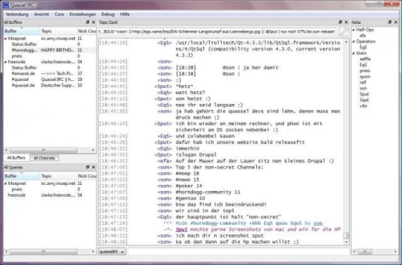
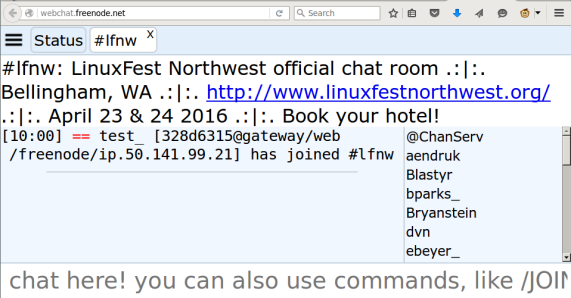
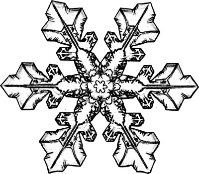
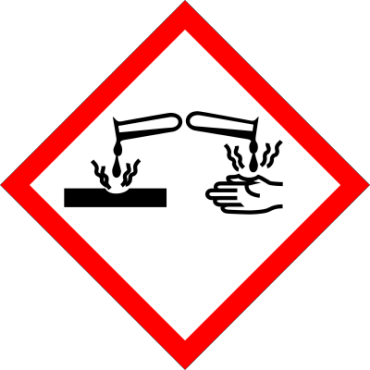
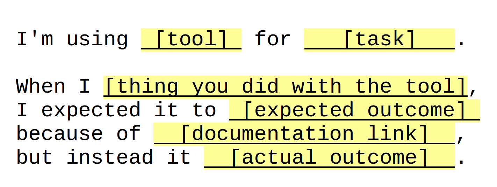
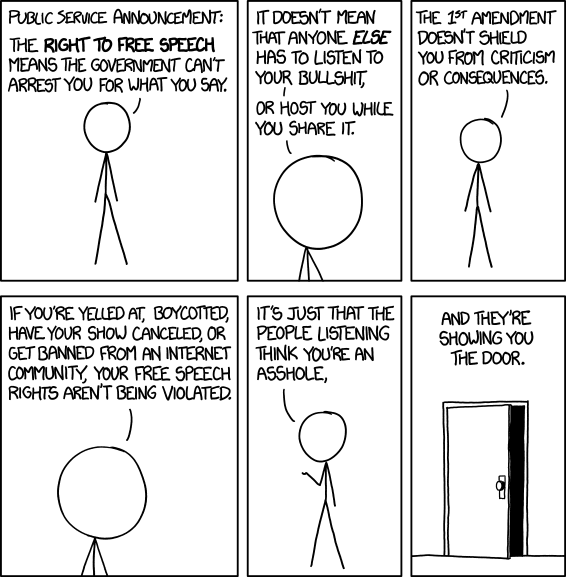

======================
How to get help on IRC
======================

.. note:: also include /msg memoserv help send
         also include etiquette -- don't assume gender, don't asktoask
         also /ns vs /msg nickserv@services vs /msg nickserv when splitty
         in the "do not list on freenode", we have /msg alis help list
         alis is a lady protagonist from a book; freenode-specific services

Hi
==

.. figure:: static/e-with-penguins.jpg
    :align: right
    :scale: 50%

* @qedunham
* edunham on irc.freenode.net
* lfnw@edunham.net
* ``talks.edunham.net/lfnw2016/irc``

This Talk
=========

* What's IRC?
    * Networks
    * Servers
    * Channels
    * Clients
* How to get help
    * Finding a channel
    * Asking good questions
    * What not to do

What's IRC?
===========

* https://tools.ietf.org/html/rfc1459
* https://tools.ietf.org/html/rfc2812
* https://tools.ietf.org/html/rfc2813

.. note::

    IRC is a protocol. HTTP and HTTPS are also protocols. The above RFCs
    define IRC; I tried reading them but they weren't hiding any
    enlightenment.

    Note that IRC was designed in an era when networks were terrible and
    bandwidth was expensive. Its design involved some tradeoffs to make it the
    best for the resources available at the time.

Servers...
----------

.. figure:: static/network.png
    :align: center

... Make up a network.
----------------------

.. figure:: static/network-abstraction.png
    :align: center

You join the network
--------------------

.. figure:: static/purple-says-connect.png
    :align: center

and you're connected to a server.
---------------------------------

.. figure:: static/purple-is-on-venus.png
    :align: center

You join a channel.
-------------------

.. figure:: static/purple-joins-chat.png
    :align: center

Someone else joins
------------------

.. figure:: static/green-joins-network.png
    :align: center

and gets connected to a server.
-------------------------------

.. figure:: static/green-is-on-saturn.png
    :align: center

They join a channel
-------------------

.. figure:: static/green-joins-chat.png
    :align: center

and you can talk to each other!
-------------------------------

.. figure:: static/message-goes-through-network.png
    :align: center

Elisions
--------

* Configuration settings include name, "cloaks", etc

* Many status messages are available

* Asynchronous communication

Choosing a Client
=================

* Persistence
* Devices
* Have a server?

Local client
------------

.. figure:: static/local-client.png
    :align: center

Persistent client
-----------------

.. figure:: static/irssi-or-weechat.png
    :align: center

Bouncer
-------

.. figure:: static/znc.png
    :align: center

Matrix
------

.. figure:: static/matrix-diagram.png
    :align: center

Which Client?
=============

    https://pixabay.com/static/uploads/photo/2015/03/30/12/42/network-698598_960_720.jpg

* Irssi
* Weechat
* Colloquy
* Quassel
* Matrix
* webchat.freenode.net

Irssi
-----

.. figure:: static/irssi.png
    :align: right
    :scale: 50%

* Command-line
* Written in perl, extend with perl
* Good docs
* GPL2
* all platforms w/ Cygwin

Weechat
-------

.. figure:: static/weechat.png
    :align: right
    :scale: 50%

* Command-line
* written in C, extend with python, perl, ruby, lua, tcl, guile (scheme), javascript
* Linux, BSDs, and OSX

ZNC
---

.. figure:: static/znc-web-ui.png
    :align: right

* Bouncer
* Written in C++
* Apache2 license
* https://github.com/znc/znc

Colloquy
--------

.. figure:: static/colloquy.png
    :align: center

* Written in objective-C, extend with HTML/CSS/JS
* OSX & iOS, GPL / BSD licensed
* http://colloquy.info/

Quassel
-------

* Written in C++ w/ QT4 framework
* Cross-platform, GPL
* http://www.quassel-irc.org/

Matrix
------

.. figure:: static/matrix-vector.png
    :align: center

* http://matrix.org, https://vector.im/beta/
* Actually a spec; implementations Apache2
* XMPP replacement

webchat.freenode.net
--------------------

* uses http://www.qwebirc.org/, GPL2
* freenode-only
* mibbit similar but nonfree

Where do I run my client/bouncer?
---------------------------------

.. note::

    Cheap, private, easy. Pick 1.5.

* Student?
    * School shell server
    * DigitalOcean credit from github.com/edu
* Got $5/month to spare?
    * DigitalOcean VPS
* Easier + cheaper + less private?
    * https://tuxfamily.org
    * https://firrre.com/
        * identity on IRC+Github must be 60 days old
    * Ask a friend with a VPS

Review
======

.. rst-class:: build

* How IRC works
    * Network of servers, has channels
    * Talk in channels or private messages
* Ways to connect
    * Directly from a client
    * Persistent client or bouncer
* Client options
    * Irssi, Weechat, Colloquy, Quassel, Matrix, webchat

Choosing Your IRC Name
======================

* Nicknames (nicks, handles) unique on network
* Think email address rules
    * Professionalism
    * Anonymity
    * Don't change too often
* Answers "who are you?"

First Impressions
-----------------

.. figure:: static/e-with-penguins.jpg
    :align: center

First Impressions
-----------------

.. figure:: static/e-washing-a-chicken.jpg
    :align: center
    :scale: 75%

.. note::

    We all judge people. Rather than being judged by your face or
    your voice or your clothes, on IRC you're judged by what you say. The first
    thing any message you send on IRC says is your nick.

    * Professional
    * Perhaps anonymizing?
    * gender & interests

Nickname Uniqueness
-------------------

    https://pixabay.com/en/pencil-drawing-snowflake-ice-crystal-450634/

* Freenode, GitHub, Twitter
* URL? Ends in TLD?
* Google it
* Check UrbanDictionary.com
* Tab completion!

But...

* Combo of real/preferred names is safe bet
* shorter > longer
* "nonsense" is ok

Dangers
-------

    https://upload.wikimedia.org/wikipedia/commons/thumb/a/a1/GHS-pictogram-acid.svg/2000px-GHS-pictogram-acid.svg.png

* Long names get shortened
* Pronounciation varies
* Difficult + annoying to change often
* Famous character names ~= masks
* Especially don't impersonate project leads
* Reference to irrelevant subject = invitation to discuss
* Trendy now = dated later

Registering your nick
---------------------

``/nick mynickname``

|

``/msg nickserv help register``

|

``/msg nickserv identify mynickname mypassword``

Getting Help
============

    https://www.flickr.com/photos/83633410@N07/7658298768

* Define the problem
* Make the problem reproduceable
* Ask at the right time in the right place
* Be polite and patient

Define The Problem
------------------

Recognize XY Problems
---------------------

    http://arborist101.com/wp-content/uploads/2014/02/How-To-Start-a-Gas-Chainsaw.jpg

* User wants to do X.
* User doesn't know how to do X, but thinks can get to it fromY.
* User doesn't know how to do Y either.
* User asks for help with Y.
* http://mywiki.wooledge.org/XyProblem

Make the Problem Reproduceable
------------------------------

    https://upload.wikimedia.org/wikipedia/commons/thumb/6/6a/Icon_Copier.svg/2000px-Icon_Copier.svg.png

* You're confused? State what you searched for or what you didn't understand
* Trouble reproducing SW bug is itself a problem you can use this on
* Diligence here solves many problems

Ask at the right time & place
-----------------------------

    https://upload.wikimedia.org/wikipedia/commons/e/ec/Down_the_Rabbit_Hole.png

Where?

* ``grep -ri irc *`` in project's source, docs, site
* Guess on Freenode!
* Google "projectname IRC"

When?

* "Lurk More"
* Respect asynchronicity, everyone's a volunteer
* Remember mailing lists, forums, issue trackers

Be Polite and Patient
---------------------

    https://xkcd.com/1357/

Examine Assumptions
-------------------

    https://upload.wikimedia.org/wikipedia/commons/9/99/Brazilians_001.JPG

* Age
* Wealth or lack thereof
* Location
* Time zone or subjective time of day
* Appearance, preferred pronouns
* Mental health or conditions
* Religion, politics, or lack thereof

Would you say this if everything you assumed about the person was actually the
opposite?

.. note::

    * Exercise for handling assumptions: Picture the person in your head.
    Would you say the thing you're about to if all those assumptions were
    wrong?

    ie in #linuxchix I expect that I'm speaking with someone age 20-60,
    probably female, probably from the US or India, probably involved in a tech
    career.

    But I shouldn't say anything that would offend someone male, 12 or 80
    from Russia or Brazil who works as a pilot or doctor or waiter.

Respect others' time
--------------------

* Don't flood.
    * Use a pastebin.
    * PuTTY pastes on right-click

* Use ``/topic``.
    * Read the links
    * Follow the rules

* If you must guess a pronoun, use they/them/their

.. note::

    * Exercise to prevent flooding: Join into an empty channel
      (#edunhams-test-channel or w/e your nick is) and try to paste 20 lines.
      See if your client stops you. Learn how to make it stop you, then test
      again.

Compare Goals
-------------

    https://c1.staticflickr.com/5/4148/5026217210_579f95f5db_b.jpg

    https://upload.wikimedia.org/wikipedia/commons/6/64/Ice_hockey_goal_2014_01.JPG

* What do you want to get from the conversation?
* Why are they helping you?

.. note::

    * Psychology...
    * What do you want to get out of this conversation?
        - technical solution?
        - advice?
        - confirmation of exisitng belief / win an argument?
        - share anger/sadness/frustration?
    * What do they want to get out of it?
        - respect/admiration?
        - success for the project, in form of new users or wider adoption or
          good press?
        - distraction/procrastination from something else?
    * Identify how helping you gets them what they want. Bonus points for
      following up with an action that helps them after they help you -- ie
      tweet, blog, tell someone else, thank them

To Recap
--------

* Define the problem
* Make the problem reproduceable
* Ask at the right time in the right place
* Be polite and patient

Questions?
----------

* @qedunham
* edunham on irc.freenode.net
* lfnw@edunham.net
* Slides at ``talks.edunham.net/lfnw2016/irc``

