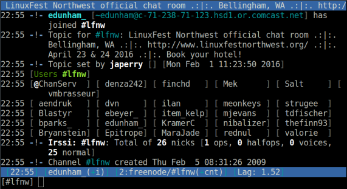

======================
How to get help on IRC
======================

.. note:: also include /msg memoserv help send
         also include etiquette -- don't assume gender, don't asktoask
         also /ns vs /msg nickserv@services vs /msg nickserv when splitty
         in the "do not list on freenode", we have /msg alis help list
         alis is a lady protagonist from a book; freenode-specific services

==
Hi
==

.. figure:: static/e-with-penguins.jpg
    :align: right

@qedunham
edunham on irc.freenode.net
lfnw@edunham.net

=========
This Talk
=========

* What's IRC?
    * Networks
    * Servers
    * Channels
    * Clients
* How to get help
    * Finding a channel
    * Asking good questions
    * What not to do

What's IRC?
===========

* https://tools.ietf.org/html/rfc1459
* https://tools.ietf.org/html/rfc2812
* https://tools.ietf.org/html/rfc2813

.. note::

    IRC is a protocol. HTTP and HTTPS are also protocols. The above RFCs
    define IRC; I tried reading them but they weren't hiding any
    enlightenment.

    Note that IRC was designed in an era when networks were terrible and
    bandwidth was expensive. Its design involved some tradeoffs to make it the
    best for the resources available at the time.

Servers...
----------

... Make up a network.
----------------------

You join the network
--------------------

and you're connected to a server.
---------------------------------

You join a channel.
-------------------

.. figure:: static/purple-joins-chat.png
    :align: center

Someone else joins
------------------

and gets connected to a server.
-------------------------------

They join a channel
-------------------

.. figure:: static/green-joins-chat.png
    :align: center

and you can talk to each other!
-------------------------------

.. figure:: static/message-goes-through-network.png
    :align: center

Elisions
--------

* Configuration settings include name, "cloaks", etc

* Lots of extraneous messages are available to you -- joins, parts, quits,
  nickname changes. You'll want a client that helps you hide the ones you
  don't care about.

* Asynchronous communication -- time zones, etc. mean it can sometimes be
  hours before you get a reply. You want a client that stays in the channel
  even when your portable device is asleep.

Choosing a Client
=================

* Persistence
* Devices
* Have a server?

Local client
------------

.. figure:: static/local-client.png
    :align: center

Persistent client
-----------------

Bouncer
-------

.. figure:: static/znc.png
    :align: center

Matrix
------

.. figure:: static/matrix-diagram.png
    :align: center

Which Client?
-------------

* webchat.freenode.net
* Irssi
* Weechat
* Colloquy
* Quassel
* Matrix

Irssi
-----

* Command-line
* Written in perl, extend with perl
* Good docs
* GPL2
* all platforms w/ Cygwin

Weechat
-------

.. figure:: static/weechat.png
    :align: right

* Command-line
* written in C, extend with
    * python
    * perl
    * ruby
    * lua
    * tcl
    * guile (scheme)
    * javascript
* Linux, BSDs, and OSX

ZNC
---

* Bouncer
* Written in C++
* Apache2 license
* https://github.com/znc/znc

Colloquy
--------

.. figure:: static/colloquy.png
    :align: right

* Written in objective-C, works on WebKit, extend with HTML/CSS/JS
* OSX & iOS
* GPL / BSD licensed
* http://colloquy.info/

Quassel
-------

.. figure:: static/quassel-on-windows.png
    :align: right

* Written in C++ w/ QT4 framework
* Cross-platform
* GPL
* http://www.quassel-irc.org/

Matrix
------

.. figure:: static/matrix-vector.png
    :align: right

* http://matrix.org
* https://vector.im/beta/
* Actually a spec; implementations Apache2
* XMPP replacement

Review
======

* How IRC works
    * Network of servers
    * Network has channels
    * Talk in channels or private messages
* Ways to connect
    * Directly from a client
    * Persistent client
    * Bouncer
* Client options
    * Freenode webchat
    * Irssi/Weechat
    * Colloquy/Quassel
    * Matrix

Choosing a Name
===============

* Nicknames (nicks, handles) unique on network
* Think email address rules
    * Professionalism
    * Anonymity
    * Don't change too often
* Networks help you protect your nick

First Impressions
-----------------

.. figure:: static/e-with-penguins.jpg
    :align: center

First Impressions
-----------------

.. note::

    We all judge people. Rather than being judged by your face or
    your voice or your clothes, on IRC you're judged by what you say. The first
    thing any message you send on IRC says is your nick.

    * Professional
    * Perhaps anonymizing?
    * gender & interests

Registering your nick
---------------------

``/msg nickserv help register``

Getting an Unaffiliated Cloak
-----------------------------

privacy etc., or get project cloak

TODO FIXME

Getting Help
============

Neat Tricks
-----------

* Connect several times from 1 client, for different nicks on a network
* /reconnect if there's a netsplit

