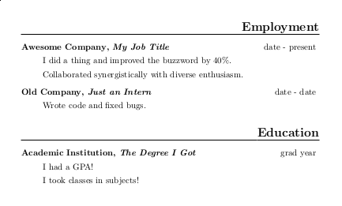

==========================
You Need A Resume Tomorrow
==========================

edunham

LUG Lightning Talks

2/17/2015

Wait, What? Why?
================

.. rst-class:: build

* Do you want a cool job?

* Are you nervous about interviews?

* Were you nervous about coming to LUG the first time?

* LUG isn't that scary any more.

* Same effect works on interviews. 

* **Take your resume to the career fair**

* **Either nothing will happen or you'll get interview practice**

LaTeX
=====

.. rst-class:: build

* Preamble::

    \documentclass[11pt]{article}

* Packages::

    \usepackage[normalem]{ulem} 
    \usepackage[compact]{titlesec}
    \usepackage[cm]{fullpage}

* Paragraphs::

    \begin{document}
    ...
    \end{document}

What To Say?
============

.. rst-class:: build

* Education and Experiences
    * Where, Who, When, What
    * Strong Verbs
    * Quantify Everything
* Optional: Skills, Objective
* **Why does the reader care?**

Hazards
=======

.. rst-class:: build

* Inconsistent verb tense

* Skills claims without related experience

* Unclear why an item is there

* Too much text

* Unflattering layout 

Say It Beautifully
==================

WHITESPACE, WHITESPACE, WHITESPACE.

.. rst-class:: build

* Text Spacing::

    \setlength{\parindent}{0pt}
    \setlength{\itemsep}{1pt}
    \setlength{\parskip}{1.5pt}
    \setlength{\parsep}{0pt}

    \bigskip
    \smallskip

* Alignment:: 
    
    \hfill
    \centerline{{\LARGE Your Name}}

Macros
======

::

    \newcommand{\heading}[1]{
        \section*{\uline{\hfill #1}}}
    \newcommand{\experience}[3]{
        \item[{#1}, \emph{#2}]
        \hfill #3 }

::

    \heading{Employment}
    \begin{description}
    \experience{Awesome Company}
               {My Job Title}
               {date - present}

        I did a thing and improved the buzzword by 40\%.
    \end{description}

It's Pretty
===========

|

Out Of Time
===========

http://edunham.net/2015/02/14/resume_improvement_with_latex_macros.html

http://lug.oregonstate.edu/blog/resume/

