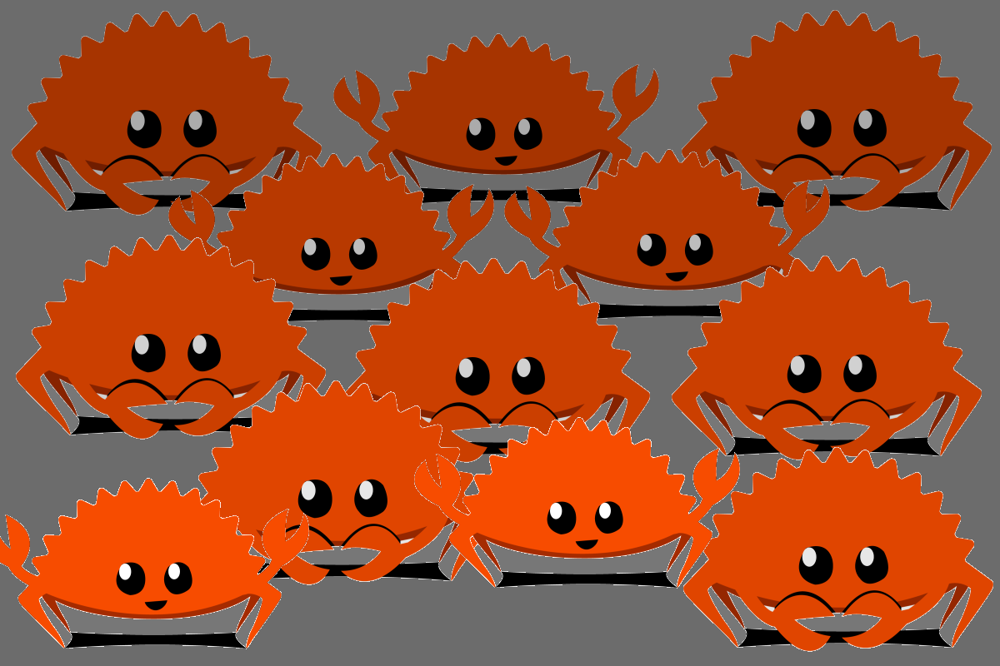

.. Life is better with Rust's Community Automation slides file, created by
   hieroglyph-quickstart on Sun Jan 31 18:41:53 2016.

.. slide::

    .. figure:: /hieroglyph-static/titleslide.png
        :class: fill

=========================
talks.edunham.net/lca2016
=========================

lca2016@edunham.net
@qedunham

.. slide::

    .. figure:: /hieroglyph-static/rustlogo.png
        :class: fill 

        
.. slide:: 

    .. figure:: /hieroglyph-static/first-rust-commit.png
        :align: center

Rust
----

* Safe
* Concurrent
* Fast

.. note:: 
    
    How?

    * Ownership
    * Borrowing
    * Lifetimes

    Out of these requirements fall zero-cost abstraction, a type system
    that makes Haskellers happy, etc

.. slide:: 

    "Fortunately, perhaps the most impressive aspect of Rust is the welcoming
    community that supports it. This community could become Rust’s not-so-secret
    weapon."

    - http://www.infoworld.com/article/2947214/open-source-tools/two-reasons-the-rust-language-will-succeed.html

.. slide::

    .. figure:: /hieroglyph-static/humans-quote.png
        :align: center

    http://scattered-thoughts.net/blog/2015/06/04/three-months-of-rust/

.. slide:: 

    .. figure:: /hieroglyph-static/automate.png
        :class: scale

.. slide:: 

    .. figure:: /hieroglyph-static/habit.png
        :class: scale

.. slide:: 

    .. figure:: /hieroglyph-static/life-is-better.png
        :class: fill

    .. note::

        The Rust community isn't free of problems, but there are some issues that
        I've seen show up pretty consistently in other places where I've been
        involved, which Rust seems to lack. I've had a unique opportunity to pick
        the brains of the core team members about how things got this way, and I'm
        here to share what I wish I'd known earlier. 

        I think these work so well because *it's always been that way*. 

.. slide::

    .. figure:: /hieroglyph-static/diversity.png
        :class: scale

    .. note:: 

        Diversity of thought causes problems. Yes, you heard that correctly. A
        community who all thinks the same is not diverse. 

        When you get enough diverse viewpoints, some will oppose others. When this
        happens about non-technical things, people get hurt and offended -- I can
        genuinely think it's cool to tell you how pretty you are and you can
        genuinely think it's horribly uncool and harrassing, and it doesn't matter
        who's right or wrong but most communities end up resolving "right" and
        "wrong" with trial by verbal combat. 

.. slide:: 

    .. figure:: /hieroglyph-static/CoC.png
        :class: fill

    .. note::

        https://www.rust-lang.org/conduct.html

        Setting a CoC differentiates 2 kinds of people: Those who'll follow it and
        those who won't. "I'll just be nice" -> what about when your definition of
        "nice" violates CoC?

        Laying these ground rules before they're needed *homogenizes* the
        community by *excluding* the people who are unwilling to change. This
        gives us a chance at resolving disputes civilly, and it usually works!

        We plaster it everywhere -- discourse automatically shows it, it's all
        over github, Rust meetups flaunt it -- because keeping out the people who
        see trial by combat as the best solution makes the community a much more
        enjoyable place for the rest of us.     

        Who are we excluding?

.. slide:: 

    .. figure:: /hieroglyph-static/conduct-everywhere.png
        :class: fill

    .. note:: 

        We also have a presence on diverse platforms, but CoC is the unified
        "party line" across all of them. 

        This is also the first example of VIRALITY of good practices. 

        Is that kinda scary? Some poeple think so. 

.. slide:: 

    .. figure:: /hieroglyph-static/attacksquad.png

    -- http://developers.slashdot.org/comments.pl?sid=8652809&cid=51352141

    .. note:: 

        The Rust community gives me a particularly bad feeling. They're rather
        tyrannical about enforcing their code of conduct. They even have a moderation
        attack squad [rust-lang.org] to go after anyone they deem to be an enemy! I've
        never seen this kind of orchestrated control exerted over the community of any
        other programming language. This sets off warning alarms for me.
        

        That's one of the indiduals whom we have intentionally excluded from
        participating in the Rust community. We think that this is okay.

Disclaimer
----------

.. note:: 

    This works for Rust because everyone in the current community either
    wanted the CoC or joined after it was enstated (thus is ok with it). I
    know somebody's going to ask me how you get a CoC *in*. That's a really
    huge, difficult problem that I'm not going to talk about here. 

    The moral of the story is to get everyone on the same page about the
    community's values ASAP, preferably before the project gets big. 

.. slide::
 
    Now we have people who agree on *how* they want to build code. *what* do they
    build?

    In other communities, people guess. Then they put lots of time into
    something, and then the rest of the community doesn't want it, and then
    they're sad.

Unappreciated Contributions
===========================

.. note::

    People get sad and angry when they put a bunch of their life into a new
    feature only to be told it's not what the project wants or needs. 

    Combine that with "pull requests welcome" as a synonym for "I don't want
    to explain all the things I dislike about that, but I don't think it's
    possible anyway, so please leave me alone", and you get people feeling
    rejected a lot.

.. slide::

    .. figure:: /hieroglyph-static/time-vs-pain.png
        :class: fill 

    .. note:: 

        One way to feel unappreciated is if you spent a bunch of time building
        the wrong code. Rust's solution is the RFC process.  

RFC process
-----------

.. figure:: /hieroglyph-static/rfcs-repo.png
    :class: scale

.. note:: 
    You don't get as attached to a written proposal that's explicitly only a
    suggestion. 

    But 

.. slide::

    .. figure:: hieroglyph-static/friends-of-the-tree.png
        :class: fill

    .. note:: 
        The This Week In Rust newsletter names the project's new contributors and
        often thanks a Friend Of The Tree

        * Community members built http://edunham.github.io/rust-org-stats/

        The Tree is important to us. Because the next huge problem that open
        source projects face is.... broken tree!

Broken Tree
===========

.. note:: Why's it bad when the tree breaks? 

.. slide:: 

    .. figure:: /hieroglyph-static/not-rocket-science.png
        :align: center
        :scale: 80%

    http://graydon.livejournal.com/186550.html

    .. note:: 

        The Not Rocket Science Rule of Software Engineering

.. slide::

    .. figure:: /hieroglyph-static/rocketscience.png
        :class: fill

.. slide::

    .. figure:: /hieroglyph-static/bors-commits.png
        :class: scale

.. slide:: 

    .. figure:: /hieroglyph-static/borscommits.png
        :class: scale

Bors
====

.. figure:: /hieroglyph-static/bors-book.jpg
    :class: scale
    :align: center

.. note:: 

    I'm used to a paradigm where it's newbie vs maintainer

    Bors changes the conversation. By personifying the testing system, we
    shift away from newbies maintainers... <slide>

.. slide:: 

    .. figure:: /hieroglyph-static/humans-vs-robots.png
        :class: fill

.. slide:: 

    .. figure:: /hieroglyph-static/buildbot-nut.png
        :class: scale

    .. note:: 

        Buildbot allows us to run community builders for platforms that aren't
        officially supported. It helps turn "no" into "PRs welcome". Of course
        we have to be choosy about who if anyone we take snaps from, and
        communicate endorsement or lack thereof to the community. 

        And as you may have noticed, we have a *lot* of comunity
        buzz/hype/popularity at the moment. This means a lot of newbies. 

Bors Logic
==========

.. code-block:: shell 

    if state==UNREVIEWED or DISCUSSING, look for r+ or r-:
        if r+, set APPROVED
        if r-, set DISAPPROVED

    if state==APPROVED, merge pull.sha + master => test_ref:
        if merge ok, set PENDING
        if merge fail, set ERROR (pull req bitrotted)

    if state==PENDING, look at buildbot for test results:
        if failed, set FAILED
        if passed, set TESTED
        (if no test status, exit; waiting for results)

    if state==TESTED, fast-forward master to test_ref
        if ffwd works, close pull req
        if ffwd fails, set ERROR (someone moved master on us)

.. note:: 

    The general cycle of bors' operation is as follows:

    load all pull reqs
    load all statuses and comments
    sort them by the STATE_* values below

    pick the ripest (latest-state) one and try to advance it, meaning:

        if state==UNREVIEWED or DISCUSSING, look for r+ or r-:
            if r+, set APPROVED
            if r-, set DISAPPROVED
            (if nothing is said, exit; nothing to do!)

        if state==APPROVED, merge pull.sha + master => test_ref:
            if merge ok, set PENDING
            if merge fail, set ERROR (pull req bitrotted)

        if state==PENDING, look at buildbot for test results:
            if failed, set FAILED
            if passed, set TESTED
            (if no test status, exit; waiting for results)

        if state==TESTED, fast-forward master to test_ref
            if ffwd works, close pull req
            if ffwd fails, set ERROR (someone moved master on us)

Bors vs Homu
============

https://github.com/graydon/bors

    * Stateless
    * Polls all PRs on cron job

https://github.com/barosl/homu

    * Keeps state
    * Runs when triggered by GitHub hooks
    * Supports `rollup` and `try`

.. note:: 

    Homu is an incremental improvement on Bors; carries state, allows try
    builds, listens for pushes from Git hooks rather than polling the repo

Solved Problems
===============

* Nice people
* Appreciated contributions
* Tree "can't" break

.. note:: 

    Next problem... things are awesome and we're building a cool product and
    now EVERYBODY wants to get involved!

Too Many Contributors?!
=======================

.. note:: 

    Ok, there's really no such thing. But in other communities, I've seen core
    contributors become more and more grumpy the more times they have to say
    the same thing over and over again to a stream of newcomers. 

    I've even experienced it myself, and realized it's called burnout. 

    But the Rust community has some automation to reduce the overhead that
    these new contributors place on core team folks. 

Highfive
========

.. figure:: /hieroglyph-static/rust-highfive.png
    :class: scale

.. note:: 

    Highfive is a bot who helps create a welcoming environment. 

    This shows off Highfive's 3 key features: Assigning reviewer,
    welcoming newbie, and providing useful information on appropriate repos. 

Highfive Configuration
======================

.. code-block:: json

    {
    "groups": {
        "all": ["core"],
        "compiler": ["@pnkfelix", "@nrc", "@Aatch", "@jroesch", "@arielb1"],
        "syntax": ["@pnkfelix", "@nrc", "@sfackler"],
        "libs": ["@aturon"]
    },
    "dirs": {
        "doc":              ["doc", "@manishearth"],
        "liballoc":         ["libs"],
        "libarena":         ["libs"],
        "libbacktrace":     [],
        "libcollections":   ["libs", "@Gankro"],
    ...

.. note:: 

    Rust's highfive knows there's separate teams for each repository, and
    knows what teams+individuals should be assigned to review changes in
    each directory of the tree. 

    Servo has a highfive too, which we've diverged from a bit, who handles
    things differently. This is another case of VIRALITY -- we actually
    inherited the highfive idea from servo

Starters
========

Crater
======

Summary
=======

* Good practices are a viral meme
* You can automate community

