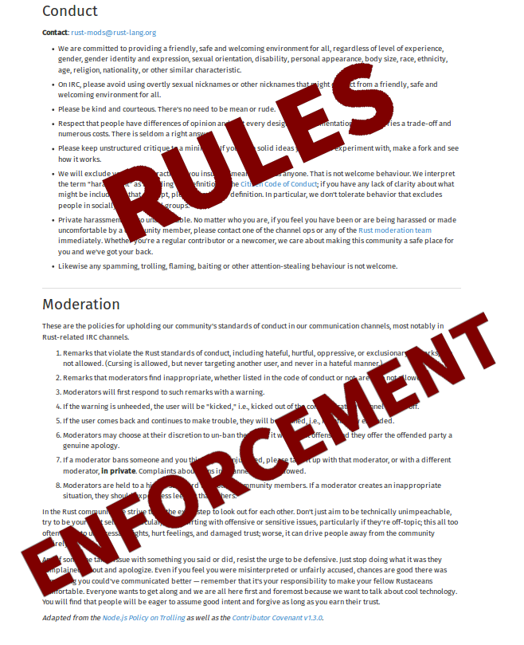
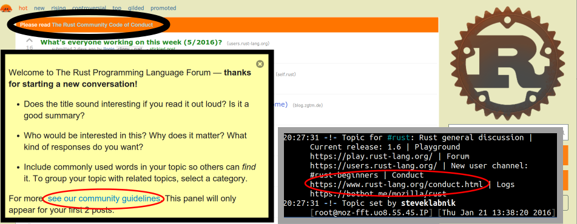

% Rust's Community Automation

<div style="text-align: center; margin-top: 10px">

</div>

E. Dunham, 9/27/2016, Automacon 2.0


# talks.edunham.net/automacon2

@qedunham

automacon@edunham.net

# 10 minutes

* No tutorials
* Examples & Inspiration


<!--
That's too fast to teach you enough Rust to do anything with, or even make a
really well reasoned case for why it might be the best tool for your use case.
That's not what I'm here for. Right now I want to take you on a whirlwind tour
of the tools and processes that've helped Rust's tiny core team grow and
cultivate a thriving community.
-->


# Rust

```rust
fn main() {
    println!("Safe, Concurrent, Fast.");
}
```

meetup.com/pdxrust

# Community

# Community

Human interaction work necessary to an open source project's success.

# Automation

# Automation

Making a computer do your work for you.

<!--
So, not all tasks are easy or even possible to automate. The first step of
building any system is scoping the problem, so I'd like to start by showing
you a couple of the filters that help decide what kinds of people and code
ever interact with our day-to-day tools.
-->

# Automating Community

Build tools that do people things.

# We control

* Who uses the tools
* What they're used on


# Moderation

<!--
CoC is 1/3 common-sense guidelines and 2/3 a clear and specific explanation of
how the mod team enforces them.

It has diversity-promoting side effects, but perhaps the most important policy
is "Please keep unstructured critique to a minimum". It's gently but thoroughly
enforced by our amazing mod team.

I think that training people to behave civilly and constructively in official
Rust spaces helps decrease the amount of someone's-being-a-jerk drama. Having
a clear escalation path also all but eliminates the generalized anger that
people start expressing when they feel both wronged and helpless.

The process of moderation cannot and should not be left to a computer, but we
can use technology to make our mods' work as easy as possible - make humans do
the things that require a human, but let the bots do the rest.
-->

<div class="pic">

</div>


# Automate Awareness

<!--
The first step to getting someone to follow a rule is to make them aware that
it exists. The CoC link is plastered all over all the official forums, and
Discourse (our mailing list alterntive) makes you click a "yes I'm being
constructive" button for your first 3 posts.

This way, claiming that you weren't aware we had a CoC makes you look so
foolish that nobody with much vanity would try it, thus saving our mods from
having to manually educate everyone.
-->

<div>

</div>


# Filtering people?!

<!--
Enforcing community guidelines and demanding that everyone pay attention to
them might not sound like a filter, but that's how diversity works.

By having Automacon in English and in Portland, we've silently filtered out
everyone who doesn't speak our language or can't afford to travel here.

It's often tough to see who the first barrier to entry in a community has
filtered out, because by definition they aren't there.... But AC on slashdot
here is an example of someone whom our CoC policies exclude.
-->

<div class="quote">
“The Rust community gives me a particularly bad feeling. They're rather
tyrannical about enforcing their code of conduct. They even have a moderation
attack squad to go after anyone they deem to be an enemy! ... This sets off
warning alarms for me.”
<br>
-- https://developers.slashdot.org/comments.pl?sid=8652809&cid=51352141
</div>


# Mandatory communication

* RFC process
* Feedback before big changes

<!--
RFCs.

Well, at least mandatory if you want to get a large change in. When we try to
automatically maintain a repository of code that always passes all the tests,
it helps to have asked "how will we test this code?" before merging stuff.

And I think it's less painful to get criticism in the early stages of
developing an idea, rather than after you've invested hours of your life in an
implementation.
-->

# Robots!

# Not Rocket Science

Automatically maintian a repository of code that always passes all the tests.

<!--

-->

# Bors

"Will all the tests pass after we merge this code?"

<!--
Unusual in that he tests the result of merging, then fast-forwards the tree.
Triggered by an r+, a human's "I think we should merge this" review. There are
features for this with Jenkins tests in Gerritt.

This has the added benefit that keeping the tests up to date and fast is now
everybody's problem, because it'll slow down your workflow if you don't.
-->

# Bors-ing without Bors

* Write tests!
* Run the tests on every change!
* *Merge only if the tests passed!*
* Find a broken test? Fix it!

<!--
This is a culture change and is easier to enstate at a project's inception
than once its testing practices have solidified.

I believe this is necessary for any code that people work on. If the code is
fully and perfectly correct, why are you changing it? If not, you need a test
suite to prevent regressions.
-->

# Talking to people

* Welcome new contributors
* Assign code reviewer
* Nag when needed

<!--
We have a robot named Highfive who:

* Notices when someone is new
* Thanks them for the PR and offers some useful info
* Assigns a reviwer based on what part of the code was touched
* Nags the reviewer if they take too long
-->

# Highfiving without Highfive

* Issue & PR Templates
* Get notified of new issues and PRs

<!--
This is essential if you're working on public code, and can be extremely
useful if you're maintaining a private project on a back-burner while
multitasking with several other things.

For internal codebases, automatically assigning a reviewer based on what parts
of the repo the commit touches is useful!
-->

# Automating mentorship

"I'm new, what should I work on?"

* Easy-tagged Issues

<!--
Many projects get into a state where there's no reward for triaging issues, so
nobody bothers to do it.

Using the tags to expose low-hanging fruit issues helps funnel in new
contributors (even if not all of them stick).
-->

# Automate mentorship

* Keep good docs
* Value docs/triage help
* List low-hanging fruit

<!--
This is great if you're working on FOSS, but also relevant for private
codebases - has anyone outside your team ever asked you to teach them a skill
that could be demonstrated by fixing a simple problem with the thing you
maintain or build for your day job?
-->

# Automate the pipeline

* CONTRIBUTING.txt
* http://www.codetriage.com/
* http://issuehub.io/
* http://up-for-grabs.net/
* http://yourfirstpr.github.io/
* https://openhatch.org

<!--
Small mentored issues are to volunteering what an internship is to a day job.


If you struggle to recruit engineers, have you considered open-sourcing a tool
that you've built and mentoring contributors on it? Offering good mentorship
will leave a lasting positive impression of your company.
-->


# Thank you!

* @qedunham
* automacon@edunham.net
* talks.edunham.net/automacon2
