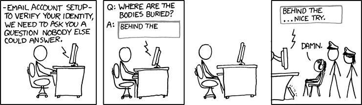
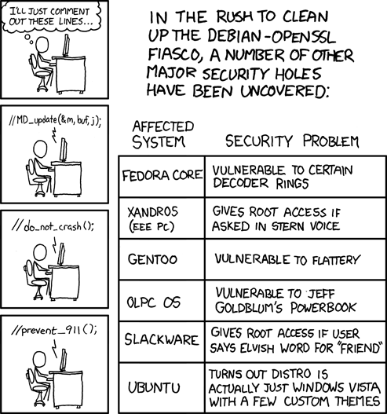

========
Security
========

Don't Be Evil
-------------

* This information is for protecting your own sytems, and for educational use
  only
* Don't break (or even touch) stuff without permission
* Responsible disclosure

  * Verify bug, give owner a chance to fix it
  * Disclose publicly only after fix or if absolutely necessary

* Test exploits only where you're permitted to (own systems are best)

Philosophies
------------

Principle of Least Authority

Responsible Disclosure

Paranoia

Resources
---------

* Databases

  * `OWASP <https://www.owasp.org/index.php/Main_Page>`_

* News

  * `EWONTFIX <http://ewontfix.com/>`_
  * `Slashdot's security section <http://slashdot.org/stories/security>`_
  * `2600 <http://2600.com/>`_

* Other

  * `Crypto101 <https://www.crypto101.io/>`_
  * `OSU's network security class
    <http://web.engr.oregonstate.edu/~rosulekm/netsec/>`_
  * `PyCon talk on SSL
    <http://pyvideo.org/video/2651/the-sorry-state-of-ssl>`_

XKCD 1354
---------

.. figure:: _static/heartbleed_explanation.png
    :align: center
    :scale: 45%

Where Exploits Come From
------------------------

* Bugs

  * Memory-unsafe languages
  * Outdated software

* Incorrect configuration

  * Settings wrong
  * Failure to update

XKCD 538
--------

|

.. figure:: _static/security.png
    :align: center
    :scale: 150%

Other issues
------------

* Physical compromise

  * boot

    * recovery mode
    * in grub, ESC -> 'e' -> rw init=/bin/bash -> ESC -> 'b'

* MITM and traffic sniffing

       * Wireshark, proxies, compromised access points

* Social engineering

    * exploit password reuse
    * impersonate trusted services

XKCD 565
--------

|

What users can do
-----------------

* Understand your firewall
* Encrypt traffic and disks
* Never reuse passwords (and use good ones)
* Practice good key hygiene
* Maintain physical security

XKCD 792
--------

.. figure:: _static/password_reuse.png
    :align: center
    :scale: 50%

What developers/sysadmins can do
--------------------------------

* Keep up to date on your tools' vulnerabilities
* Don't store more data about your users than necessary
* Log everything and look for suspicious activity
* Learn about cryptography and choose your libraries carefully
* Avoid injection attacks

XKCD 424
--------

What now?
---------

* OSU Security Club

  * contact irdan on irc.freenode.net

* Cryptography and netsec classes

* the WEP network with SSID ``hampered`` is our toy, and you may abuse it as
  you wish.
    * the T60 is connected to it and running OpenSSL 1.0.1e from Feb 11th,
      and the Systemview app vulnerable to JS and SQL injection attacks
