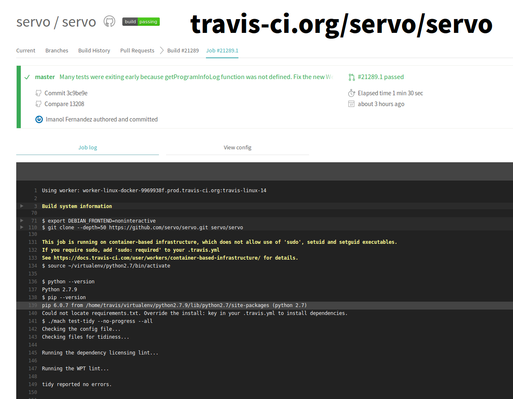

% Servo Infrastructure

Open Infrastructure Day
2017-03-02

# Contact

* talks.edunham.net/openinfra2017
* @QEDunham
* openinfraday@edunham.net

# 15 minutes

* What's Rust, what's Servo?
* Life cycle of a Servo change
* The Code
* How you can help

# What's Rust?

# www.rust-lang.org

# Design Goals

* Safe, concurrent, fast
* Systems programming, fewer footguns
* Hack Without Fear

# Rustaceans

* github.com/rust-lang/rust
* 27 @mozilla.com contributors
* 1528 non-mozilla.com contributors
* 2% of contributors, 15% of commits are @mozilla.com

# Community

"The Rust community seems to be populated entirely by human beings.  I have no
idea how this was done."

- http://scattered-thoughts.net/blog/2015/06/04/three-months-of-rust/

# Conduct

* "Please be kind and courteous."
* "Please keep unstructured critique to a minimum"
* Dedicated moderation team
* "We will exclude you from interaction if you insult, demean or harass anyone"

    - https://www.rust-lang.org/conduct.html

# Exclusion

"The Rust community gives me a particularly bad feeling. They're rather
tyrannical about enforcing their code of conduct. They even have a moderation
attack squad to go after anyone they deem to be an enemy!"

- https://developers.slashdot.org/comments.pl?sid=8652809&cid=51352141

# Other processes

* Weekly updates (This Week In Rust, etc)
* Mandatory RFCs for major changes
* Consistent PR review process
* Distributed team & public discussions

# What's Servo?

* ~12 full-time engineers
* ~612 code contributors
* ~21k commits into servo/servo
* ~4% of contributors, ~25% of commits from @mozilla.com

# How?

* Put robots to work
* Rent others' expertise
* Value volunteers
* Leverage free stuff

# www.servo.org

# Architecture

# Further Reading

https://github.com/servo/servo/wiki/Videos-and-presentations

https://github.com/servo/servo/wiki/Design

# Infrastructure Philosophy

# PR Life Cycle

* Highfive
* Homu (Bors)
* Mach
* Buildbot

# Greetings, human

# Travis kicks off tests

# Human reviews code

# Homu

# The Queue

# Buildbot

# The Waterfall

# Homu

# Buildbot

# download.servo.org

# The Infrastructure

# Highfive

# Homu

# Buildbot

# Upstream Buildbot

# S3

* Artifact storage as Someone Else's Problem

# Mach

# Upstream Mach

# Mach's Tree

# Salt Configs

# Upstream Salt

# Questions?

* Highfive
* Homu
* BuildBot
* Mach
* SaltStack

# Getting Started with Rust

# Getting Started with Servo

# Thank you!

* talks.edunham.net/openinfra2017
* @QEDunham

