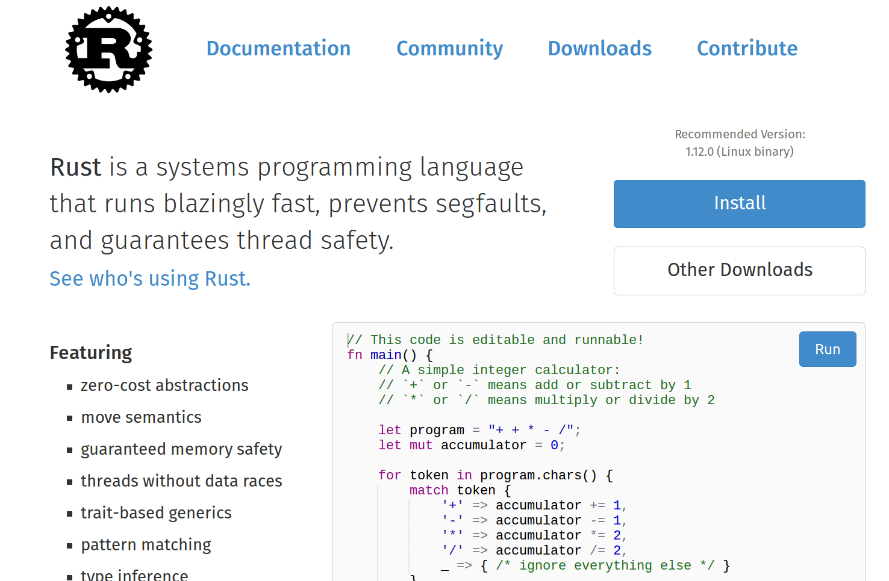
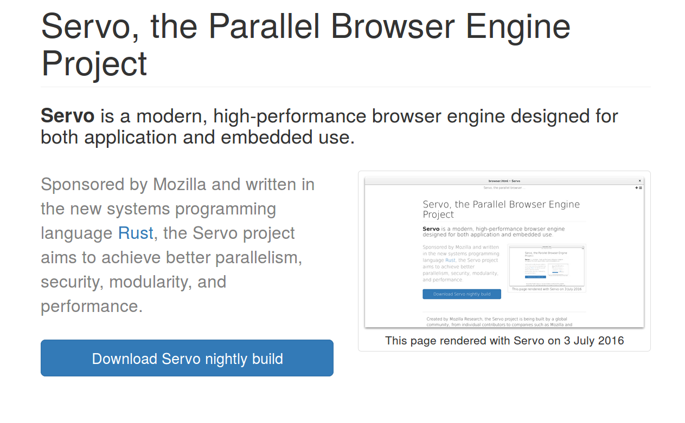

% Servo Infrastructure

PDX Python
2017-05-25

# Contact

* talks.edunham.net/pdxpython2017
* @QEDunham
* pdxpython@edunham.net

# Tonight

* What's Rust, what's Servo?
* Life cycle of a Servo change
* The Python Code
* How you can help
* Q&A Throughout

# What's Rust?

# www.rust-lang.org

# Design Goals

* Safe, concurrent, fast
* Systems programming, fewer footguns
* Hack Without Fear

# Rustaceans

* github.com/rust-lang/rust
* 27 @mozilla.com contributors
* 1528 non-mozilla.com contributors
* 2% of contributors, 15% of commits are @mozilla.com

# Community

"The Rust community seems to be populated entirely by human beings.  I have no
idea how this was done."

- http://scattered-thoughts.net/blog/2015/06/04/three-months-of-rust/

# Conduct

* "Please be kind and courteous."
* "Please keep unstructured critique to a minimum"
* Dedicated moderation team
* "We will exclude you from interaction if you insult, demean or harass anyone"

    - https://www.rust-lang.org/conduct.html

# Exclusion

"The Rust community gives me a particularly bad feeling. They're rather
tyrannical about enforcing their code of conduct. They even have a moderation
attack squad to go after anyone they deem to be an enemy!"

- https://developers.slashdot.org/comments.pl?sid=8652809&cid=51352141

# Other processes

* Weekly updates (This Week In Rust, etc)
* Mandatory RFCs for major changes
* Consistent PR review process
* Distributed team & public discussions

# What's the Servo project?

* ~12 full-time engineers
* ~612 code contributors
* ~21k commits into servo/servo
* ~4% of contributors, ~25% of commits from @mozilla.com

# How?

* Put robots to work
* Rent others' expertise
* Value volunteers
* Leverage free stuff

# What's Servo?

# Architecture

# Further Reading

https://github.com/servo/servo/wiki/Videos-and-presentations

https://github.com/servo/servo/wiki/Design

# Any questions?

* What's Rust?
* What's Servo?

# Infrastructure Philosophy

# PR Life Cycle

* Highfive
* Homu (Bors)
* Mach
* Buildbot

# Highfive greets the contributor

# Alternatives to Highfive

* GitHub PR templates
* Configure new PR notifications
* Script your bot of choice
* https://github.com/facebook/mention-bot
* http://danger.systems/

# Travis kicks off tests

# Alternatives to Travis

* Your own Jenkins/Buildbot/in-house CI
* Paid options like CircleCI
* Appveyor for Windows
* GitLab pipelines

# Team member reviews the change

# Homu tests the change

# Alternatives to Homu

* OpenStack's Zuul (more complex, fancier features)
* Roll your own

# Change waits in Homu's queue

# Buildbot delegates the tests

# Buildbot's waterfalls shows test status

# Homu lands the change

# Buildbot later makes+publishes nightlies

# download.servo.org

# Any questions?

* Highfive greets the contributor
* Travis tests all the things
* Servo person reviews the change
* Homu (@bors-servo) lands the change upon r+
* Buildbot builds things

# The Infrastructure

# Highfive

# Contribute to Highfive!

* Rust Highfive != Servo Highfive :(
* Small codebase, good practices
* Python 2.7

# Homu

# Contribute to Homu!

* Use the servo/homu fork
* Testing story is... scary bad
* Accidental home-grown state machine
* Regex!
* Sqlite!
* All python3!

# Buildbot

# Contribute to our Buildbot!

* https://github.com/servo/saltfs/tree/master/buildbot
* Configs built with Python scripts
* Requires grokking Buildbot

# Upstream Buildbot

# Maybe don't hack on upstream Buildbot

* http://trac.buildbot.net/wiki/Development
* Original authors moved on to https://docs.taskcluster.net/

# Python for nightly uploads

* S3
* Somebody Else's Problem

# Mach runs Servo's tests

# Contribute to our Mach?

* https://github.com/servo/servo/labels/A-mach

# Upstream Mach

# Mach's Tree

# Contribute to upstream Mach?

* https://developer.mozilla.org/en-US/docs/Mozilla/Developer_guide/mach
* Python 2.7, "Python 3 compliant"
* I hope you like Mercurial

# Mercurial...

# Tidy (Rust linting in Python)

* https://github.com/servo/servo/tree/master/python/tidy
* Checks licenses
* These days, use Clippy or Rustfmt

# Servo's Salt Configs

# Contribute to our Salt configs!

* https://github.com/servo/saltfs
* Good tests
* Infra practice
* Aneesh knows best practices & has high standards

# Upstream SaltStack

# Contribute to upstream Salt?

* https://github.com/saltstack
* They're nice!

# Infra Questions?

* Highfive
* Homu
* BuildBot
* Mach
* SaltStack

# Getting Started with Rust

# Getting Started with Servo

# Thank you!

* talks.edunham.net/pdxpython2017
* @QEDunham
* pdxpython@edunham.net
