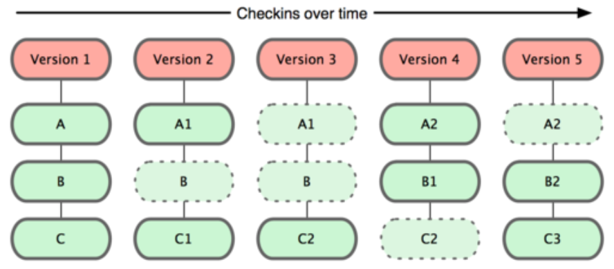
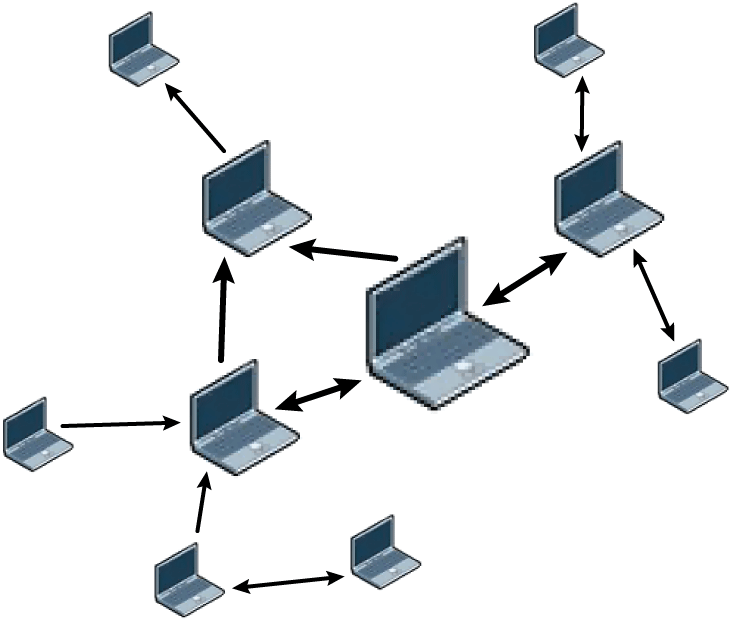
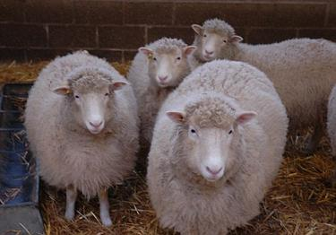
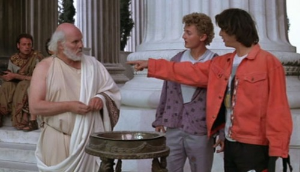
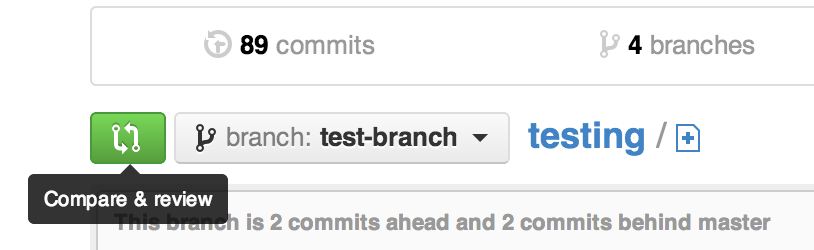

===============
Thinking in Git
===============

    Git is the most popular source code management and version control system in
    the open source community. Its complexity and power make it the best choice
    for most projects, while simultaneously giving it a daunting learning curve
    for newcomers. This talk will assume no background knowledge of version
    control, and will teach the basics of Git in order to give you an accurate
    mental model of what the tool does, and help you fix mistakes then ask the
    right questions if you run into problems using it later.

Agenda
======

.. figure:: _static/think/gitlogo.png
    :align: right

* How to look at software development 
* What's Git
* How to learn it
    * Real life vs. tutorials

Thinking about Software Development
===================================

* Changing files
    * Some changes manual, other changes automatic
    * Changes for different reasons
        * Add feature, fix bug, test idea
        * Sometimes have several reasons at once, want changes separate

.. figure:: _static/think/compiling.png
    :align: center
    :scale: 60%

Why version control?
====================

.. figure:: _static/think/phdcomic.gif
    :align: center
    :scale: 75%

Types of version control
========================

* Formal vs. impromptu
* Scalable vs. too much work
* Centralized vs. decentralized
* Concurrent vs. locking
* Diffs/patches vs. snapshots

Git's buzzwords
===============

* Decentralized
* Distributed
* Data assurance
* FOSS (GPLv2)

.. note:: We'll get to branches later

Thinking about snapshots
========================

* Represented as changes to a file plus pointers to unchanged files
* Not a diff (tracks all files)
* Not a duplicate of everything (points to unchanged files)

How Git sees your project
=========================

.. note:: Unstaged | Staged | Committed

.. figure:: _static/think/staging.png
    :align: center

Goals of Distributed Version Control
====================================

* Reliability
* No SPOF
* Eliminate network dependencies

How?
====

Setting Up
----------

* Tell Git who you are
* You'll need SSH keys later
    * GitHub can handle ECDSA, GitLab only does RSA as of 5.1.0
* Install Git
    * also tk and tcl if you want the GUI later
* Set preferred editor 
    * ``export GIT_EDITOR=vim`` in ``~/.bashrc`` or equivalent
* Pick a project to work on

.. note:: ECDSA is the new hotness -- elliptic-curve digital signature
    algorithm -- much smaller keys have comparable security

What's a **repository**?
------------------------

Database of snapshots of your code

.. code-block:: bash

    $ ls .git/

Getting a repo
--------------

.. code-block:: bash

    $ git init

    $ git clone <git clone url>

    # git@github.com:organization/reponame.git
    # https://github.com/organization/reponame.git

Looking at a repo
-----------------

.. code-block:: bash

    $ git show
    fatal: bad default revision 'HEAD'
    # To be expected with nothing in the repo

    $ git show
    fatal: Not a git repository (or any of the 
           parent directories): .git
    # not in a repo

Undo?
-----

.. warning:: 
    This deletes your history. Only do it if you really want to stop
    having a Git repo here.

 .. code-block:: bash
    
    $ rm -rf .git

What're **staged changes**?
---------------------------

.. figure:: _static/think/staging.png
    :align: center
    :scale: 75%

* Staging area is like backstage -- decide what changes go into your snapshot

* Files or parts of files can be added or removed

Staging changes
---------------

.. code-block:: bash

    $ touch foo
    $ git add foo

Looking at staged changes
-------------------------

.. code-block:: bash

    $ touch bar
    $ git status
    On branch master

    Initial commit

    Changes to be committed:
      (use "git rm --cached <file>..." 
       to unstage)
        new file:   foo
        Untracked files:
          (use "git add <file>..." to include 
           in what will be committed)
            bar
    $ git commit --dry-run

Undo?
-----

* Keeping uncommitted changes

.. code-block:: bash

    $ git rm --cached foo

* Go back to the latest committed version

.. code-block:: bash
    
    $ git reset HEAD foo

What's a **commit**?
--------------------

Snapshot of changes

Includes snapshot (with pointers to unchanged files), author, date, committer
(can differ from author), parent commit

Making a commit
---------------

.. figure:: _static/think/tardis.jpg
    :align: right

.. code-block:: bash

    $ git commit

.. code-block:: bash

    $ man git-commit
    -a, --all
    -i, --interactive
    --reset-author
    --date=<date> (see DATE FORMATS in man page)
    --allow-empty
    --amend
    -o, --only
    -S, --gpg-sign

.. note:: 
    -o is for *only files from command line* disregarding the stash
    Specifying file names disregards staged changes, plus stages all current
    contents

Looking at a commit
-------------------
|
.. figure:: _static/think/gitk.png
    :align: center 
    :scale: 50%

.. code-block:: bash

    $ git show  # details on latest commit, or specified one
    $ git log   # summary of recent commits, or a range
                # man gitrevisions for help with ranges

Commit display options
----------------------

.. code-block:: bash

    $ git show

    $ git show --oneline

    # see PRETTY FORMATS section of
    $ man git-show

    # Check the GPG signature
    $ git show --show-signature

Undo?
-----

.. code-block:: bash

    $ git revert <commit to revert to>

Reverting makes a revert commit. 

Yes, you have to; time travel is more important than "This never happened"

What's a **remote**?
--------------------

Another *clone* of more or less the same repo

(remember when we cloned to get a copy?)

Adding a remote
---------------

.. code-block:: bash

    $ man git-remote

    $ git remote add <name> <url>

Looking at remotes
------------------

.. code-block:: bash

    $ git config -e

    # OR

    $ git remote show <name>

Undo?
-----

Do you prefer text editor or commands?

.. code-block:: bash

    $ git config -e
    # delete or change remote

    $ man git-remote
    $ git remote rename <old> <new>
    $ git remote remove <name>
    ...etc.

.. note:: "Undoing" push to remote is... trickier

What's a **tag**?
-----------------

.. figure:: _static/think/graffiti.jpg
    :align: center

* Marker attached to a specific commit
* Typically used for version or release number

Adding a tag
------------

.. code-block:: bash

    $ man git-tag
    $ git tag -m <msg> <tagname> 

Default is lightweight tag -- just a reference for SHA-1 of latest commit
Pass ``-s`` or ``-u <key-id>`` to GPG-sign

Looking at tags
---------------

.. code-block:: bash

    # List all available tags
    $ git tag                   

    # List tags matching regex
    $ git tag -l 'regex'        

    # I want this version!
    $ git checkout <tag name>   

Undo?
-----

.. code-block:: bash

    $ git tag -d <tagname>
    # And remove it from a remote repo
    $ git push origin :refs/tags/<tagname> 

What's a **branch**?
--------------------

.. figure:: _static/think/gitflow_branches.png
    :align: center

A parallel path of development, starting from a commit that's in the tree

.. note:: Point out why the arrows are "backwards"

Making a branch
---------------

.. code-block:: bash

    # track remote branch by default if one matches
    $ git checkout -b <branchname>

    # Shorthand for:
    $ git branch <branchname>   # create
    $ git checkout <branchname> # check out

    # Pushing a branch to a remote
    $ git push <remotename> <branchname>

Looking at branches
-------------------

.. code-block:: bash

    $ git branch

    $ git show <branchname>

Undo?
-----

.. code-block:: bash
    
    # delete only if fully merged
    $ git branch -d

    # sudo delete
    $ git branch -D

    # delete remote branch
    $ git push <remotename> :<branchname> 

What's a **merge**?
-------------------

* Converges the divergent branches

Making a merge
--------------

.. figure:: _static/think/merge.png
    :align: center
    :scale: 75%

.. code-block:: bash

    # Branch you're changing
    $ git checkout mywork

    $ git merge master

    # Merge conflicts?
    $ git status
        On branch mywork
        You have unmerged paths.
          (fix conflicts and run "git commit")

.. note:: COMMIT OR STASH CHANGES FIRST

Merge Conflicts
---------------
|
.. code-block:: shell 

    <<<<<<< HEAD
    This content was in mywork but not master
    =======
    This content was in master but not mywork  
    >>>>>>> master

Replace all that stuff with what the content *should* be.

``git add`` the file. 

Check that you've got everything with ``git status``, then commit.

Or consider ``git mergetool`` for a graphical option.

Looking at merges
-----------------

.. code-block:: bash

    $ git diff <commit before merge> <merge commit>

    # before merging, see changes
    $ git log ..otherbranch
    $ git diff ...otherbranch
    $ gitk ...otherbranch

Undo?
-----

.. code-block:: bash

    $ git merge abort
    $ git reset --keep HEAD@{1}

What's a **rebase**?
--------------------

Rebasing
--------

Can you look at a rebase?
-------------------------

Undo?
-----

GitHub Stuff
============

GH is not exactly Git. 

* Less distributed paradigm
* Git carefully never told us who to trust

Watch `Linus's talk <https://www.youtube.com/watch?v=4XpnKHJAok8>`_ for enlightenment

HTTP vs SSH clones
------------------

.. code-block:: bash

    Permission denied (publickey).
    fatal: Could not read from remote 
    repository.

    Please make sure you have the 
    correct access rights and the 
    repository exists.

Forking
-------

.. figure:: _static/think/forking.gif
    :align: center
    :scale: 150%

* Parallel repos (or possibly divergent)
* Duplicating the "center" of the centralized VCS

Pull Requests
-------------

|

* Formalizes "Hi, please merge my changes"

Annoying tricks
---------------

* Branches keep adding their content to PRs
* Group management and access rights
* No project license required

Extra features
--------------

* Wiki
* Gist
* Issue trackers
* Cool graphs
* Repo descriptions and automatic README display

Hooks and CI
============

Hooks
-----

Jenkins
-------

Travis
------

Playing Well with Others
========================

